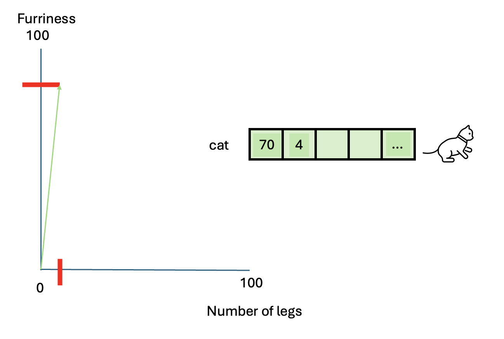
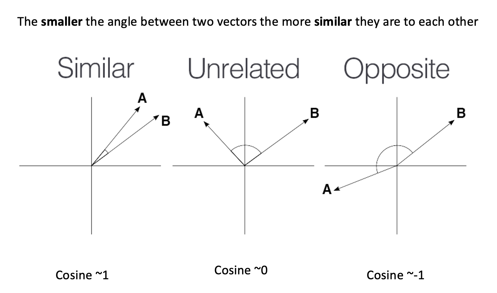
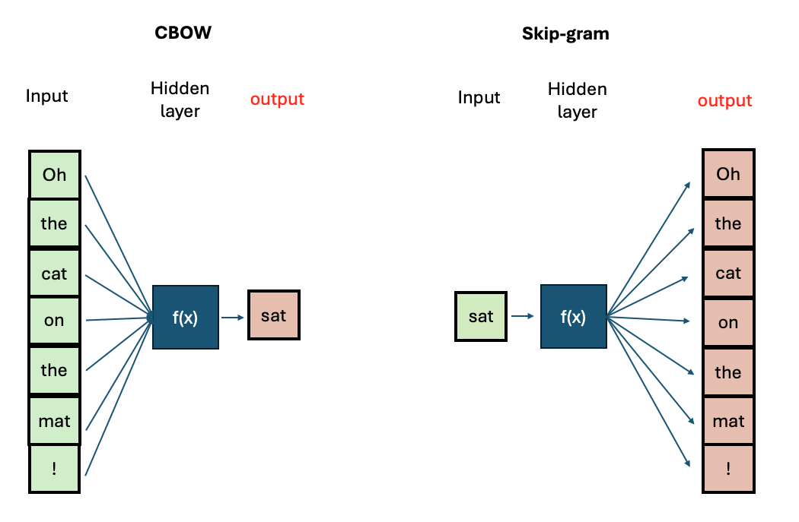

::::::::: questions

- Why do we need to prepare a text for training?
- How do I prepare a text to be used as input to a model?
- What different types of pre processing steps are there?
- How do I train a neural network to extract word embeddings?
- What properties word embeddings have?
- What is a word2vec model?
- How do we train a word2vec model?
- How do I get insights regarding my text, based on the word embeddings? 

::::::::: 

::::::::: objectives

After following this lesson, learners will be able to:

- Implement a full preprocessing pipeline on a text
- Use Word2Vec to train a model
- Inspect word embeddings

::::::::::

## Introduction

In this episode, we’ll train a neural network to obtain word embeddings. We will only briefly touch upon the concepts of `preprocessing` and `word embedding` with Word2vec. 

The idea is to get you over a practical example first, without diving into the technical or mathematical intricacies of neural networks and word embeddings. The goal for this episode, in fact, is for you to get an intuition of how computers represent language. This is key to understand how NLP applications work and what are their limits.

In the later episodes we will build upon this knowledge to go deeper into all of these concepts and see how NLP tools have evolved more complex language representations.


In this episode, we will build a workflow following these steps:

1. Formulate the problem
2. Download the input data
3. Prepare data to be ingested by the model (i.e. preprocessing step)
4. Train the model
5. Load the embeddings and inspect them 

Note that for step 5 we will cover only briefly the code to train your own model, but then we will load the output of already pretrained models. That is because training requires a large amount of data and considerable computing resources/time which are not suitable for a local laptop/computer.

## 1. Formulate the problem
In this episode we will be using Dutch newspaper texts to train a Word2Vec model to investigate the notion of *semantic shift*. 

## Semantic shift

Semantic shift, as it is used here, refers to a pair of meanings A and B which are linked by some relation. Either
diachronically (e.g., Latin *caput* "head" and Italian *capo* "chief") or synchronically, e.g. as two meanings that co-exist
in a word simoultaneously (English "head", as in "I have covered my head with a hat" and as in "I am the head of the department"). **Can we detect a semantic shift?** -- We'll tackle this phenomenon in this episode.

Newspapers make an interesting dataset for investigating this phenomenon, as they contain information about current events and the language it uses is clear and reflective of its time. We will specifically look at the evolution of specific words in Dutch across a period of time from 1950 to 1990. In order to do that, we need to train a model to extract the meaning of every single word and track in which context they occur, over decades. 

::: callout
## Goal
The goal is to analyze the semantic shift of specific Dutch words from 1950 to 1989 using newspapers as a dataset.
:::

Conceptually, the task of discovery of semantic shifts in our newspaper data can be formulated as follows:

Given newspaper corpora [C1, C2, C3, ...] containing texts created in time periods from 1950s to 1980s, considered as four decades [1: 50-60; 2: 60-70; 3: 70-80; 4: 80-90], the task is to detect how some words have shifted in meaning across those decades.

As a test-bed, we're going to focus on three words: `mobiel`, `televisie` and `ijzeren`. These words exemplify very well the notion of semantic evolution / semantic shift, as their meaning has gained new nuances due to social, technological, political and economic changes occurred in those key years.

We're going to use a model to solve this task. We're going to see which one and how in a moment.

Our dataset is provided by Delpher (developed by the [KB - the National Library of the Netherlands](https://www.kb.nl/)) which contains digitalised historic Dutch newspapers, books, and magazines. This online newspaper collection covers data spanning from 1618 up to 1995 and of many local, national and 
international publishers. 

We will load only a page to go step-by-step through what it takes to train a model. This makes it easier to know what's going on. However, in practice, when to successfully train a model you need larger quantities of data to allow the model to get more precise and accurate representations. In those cases you will simply condense each of the steps we cover next into one code, to do all these steps at once.

::: callout

# Dataset size in training

To obtain high-quality embeddings, the size/length of your training dataset plays a crucial role. Generally [tens of thousands of documents](https://cs.stanford.edu/~quocle/paragraph_vector.pdf) are considered a reasonable amount of data for decent results. 

Is there however a strict minimum? Not really. Things to keep in mind is that `vocabulary size`, `document length` and `desired vector size` interacts with each other. The higher the dimensional vectors (e.g. 200-300 dimensions) the more data is required, and of high quality, i.e. that allows the learning of words in a variety of contexts.

While word2vec models typically perform better with large datasets containing millions of words, using a single page is sufficient for demonstration and learning purposes. This smaller dataset allows us to train the model quickly and understand how word2vec works without the need for extensive computational resources.
:::

For the purpose of this episode and to make training easy on our laptop, we'll train our word2vec model using **just one page**. Subsequently, we'll load pre-trained models for tackling our task.

::::::::::::::::::::::::::::::::::::::: challenge

## Exploring Delpher

Before we move further with our problem, take your time to explore Delpher more in detail. Go to [Delpher](https://www.delpher.nl/) and pick a newspaper of a particular date. Did you find anything in the newspaper that is interesting or didn't know yet? For example about your living area, sports club, or an historic event?

::::: solution

## Few examples. 

1. The 20th of July 1969 marks an important event. The First Moon landing!
Look at what the [Tubantia newspaper](https://resolver.kb.nl/resolve?urn=KBPERS01:003319021:mpeg21:pdf) had to say about it only four days afterwards.

2. The Cuban Missile Crisis, also known as the October Crisis in Cuba, or the Caribbean Crisis, was a 13-day confrontation between the governments of the United States and the Soviet Union, when American deployments of nuclear missiles in Italy and Turkey were matched by Soviet deployments of nuclear missiles in Cuba. The crisis lasted from 16 to 28 October 1962. See what de Volkskrant published on the [24th of October, 1962](https://resolver.kb.nl/resolve?urn=ABCDDD:010876534:mpeg21:pdf). Can you see what they have organised in Den Haag related to this event?
:::::

::::::::::::::::::::::::::::::::::::::: 

## 2. Download the data

We download a page from the journal [Algemeen Dagblad](https://www.delpher.nl/nl/kranten/view?coll=ddd&query=&cql%5B%5D=%28date+_gte_+%2220-07-1969%22%29&redirect=true&sortfield=date&resultscoll=dddtitel&identifier=KBPERS01:002846018:mpeg21&rowid=3) of July 21, 1969 as `txt` and save it as `ad.txt`. We then load this file and store it in a variable called `corpus`.

```python
path = "episodes/data/ad.txt"
with open(path) as myfile:
    corpus = myfile.read()
```

::: callout
The `txt` file provides the text without formatting and images, and is the product of a technique called Optical Character Recognition (OCR). This is a technique in which text from an image is converted into text, and it's a necessary step for any scanned image to obtain plain text. Luckily for us, Delpher has already done this step for us so that we can directly use the txt. However, take into consideration that if you start from an image that contains text, you may need an additional preprocessing step.
:::

## Inspect the data

We inspect the first line of the imported text:

```python
corpus[:100]

```

`'MENS OP MAAN\n„De Eagle is geland” Reisduur: 102 uur, Uitstappen binnen 20 iuli, 21.17 uur 45 min. en'`

We can see that although the OCR applied to the original image has given a pretty good result, there are mistakes in the recognized text. For example, on the first line the word ``juli`` (july) has misinterpreted as ``iuli``.

Note also the size of the text:

```python
len(corpus)
```

There are `12354` characters inside the corpus. Note also the type of file:

```python
type(corpus)
```

Python tells us that `corpus` is a `str`, i.e. a string. This means that every single character in the text (even blank spaces) is a unit for our computer. However, what's really important for us is that the machine gets the meaning of the **words** contained in the text. That is, that is able to understand which characters belong together to form a word, and what instead is something else: Punctuation, conjunctions, articles, or prepositions. 

How do we teach our machine to *segment* the text and keep only the relevant words? This is where `data preprocessing` comes into play. It prepares the text for efficient processing by the model, allowing it to focus on the important parts of the text that contribute to understanding its meaning.

## 3. Prepare data to be ingested by the model (preprocessing)

NLP models work by learning the statistical regularities within the constituent parts of the language (i.e, letters, digits, words and sentences) in a text. However, text contains also other type of information that humans find useful to convey meaning. To signal pauses, give emphasis and convey tone, for instance, we use punctuation. Articles, conjunctions and prepositions also alter the meaning of a sentence. The machine does not know the difference among all of these linguistic units, as it treats them all as equal. Also, the decision to remove or retain these parts of text is quite crucial for training our model, as it affects the quality of generated word vectors.

Examples of preprocessing steps are:

- Cleaning the text: remove symbols/special characters, or other things that "sneaked" into the text while loading the original version.
- Lowercasing
- Removing punctuation
- Stop word removal, where you remove prepositions, conjuctions and articles 
- Tokenization: this means segmenting the text by retaining groups of characters. These groups are referred to as `tokens` and their size can vary from entire words to lemmas, or subword components (e.g. morphemes)
- Part of speech tagging: the process of labelling the grammatical role of a word, e.g. nouns and verbs.

::: callout
- Preprocessing approaches affect significantly the quality of the training when working with word embeddings. For example, [Rahimi & Homayounpour (2022)] (https://link.springer.com/article/10.1007/s10579-022-09620-5) demonstrated that for text classification and sentiment analysis, the removal of punctuation and stopwords leads to higher performance. 

- You do not always need to do all the preprocessing steps, and which ones you should do depends on what you want to do. For example, if you want to extract entities from the text using named entity recognition, you explicitly do not want to lowercase the text, as capitals are a component in the identification process.

- Preprocessing can be very diffent for different languages. This is both in terms of which steps to apply, but also which methods to use for a specific step.
:::

Let's apply a number of preprocessing steps to extract a list of words from the newspaper page.

#### 1. Cleaning the text

We start by importing the `spaCy` library that will help us go through the preprocessing steps. SpaCy is a popular open-source library for NLP in Python and it works with pre-trained languages models that we can load and use to process and analyse the text efficiently. 

```python
import spacy
```

We need to install `en_core_web_sm` because the text we're dealing with it's in Dutch This is a small pre-trained language [model from Spacy](https://spacy.io/models/nl/) containing essential components like vocabulary, syntax, and entities specifically for the Dutch language.

```python
python -m spacy download nl_core_news_sm
```

We can then load the model into the pipeline function. This function connects the pretrained model to various preprocessing steps, including the tokenisation.
```python
doc = nlp(corpus)
```

Next, we'll eliminate the triple dashes that separate different news articles, as well as the vertical bars used to divide some columns.

```python
# filter out triple dashes and vertical bars
filtered_tokens = [token.text for token in doc if token.text != "---" and token.text != "|"]

# join units back into a cleaned string
corpus_clean = ' '.join(filtered_tokens)

print(corpus_clean[:100])

```

`MENS OP MAAN „ De Eagle is geland ” Reisduur : 102 uur , Uitstappen binnen 20 iuli , 21.17 uur 45 `

#### 2. Lowercasing

Our next step is to lowercase the text. Our goal here is to generate a list of unique words from the text, so in order to not have words twice in the list - once normal and once capitalised when it is at the start of a sentence for example - we can lowercase the full text. 

```python
corpus_lower = corpus_clean.lower()

print(corpus_lower)
```
`mens op maan \n „ de eagle is geland ” reisduur : 102 uur , uitstappen binnen 20 iuli , 21.17 uur 45 [...]`

::: callout
It is important to keep in mind that in doing this, some information is lost. As mentioned before, models that are trained to identify named entities use information on capitalisation. As another example, there are a lot of names and surnames that carry meaning. "Bakker" is a common Dutch surname, but is also a noun (baker). In lowercasing the text you loose the distinction between the two.
:::

Next we move to tokenise our text. 

#### 4. Tokenisation

Tokenisation is essential in NLP, as it helps to create structure from raw text. It involves the segmentation of the text into smaller units referred as `tokens`. Tokens can be sentences (e.g. `'the happy cat'`), words (`'the', 'happy', 'cat'`), subwords (`'un', 'happiness'`) or characters (`'c','a', 't'`). The choice of tokens depends by the requirement of the model used for training, and the text. This step is carried out by a pre-trained model (called tokeniser) that has been fine-tuned for the target language. In our case, this is `en_core_web_sm` loaded before. 

::: callout
A good word tokeniser for example, does not simply break up a text based on spaces and punctuation, but it should be able to distinguish:

- abbreviations that include points (e.g.: *e.g.*)
- times (*11:15*) and dates written in various formats (*01/01/2024* or *01-01-2024*)
- word contractions such as *don't*, these should be split into *do* and *n't*
- URLs

Many older tokenisers are rule-based, meaning that they iterate over a number of predefined rules to split the text into tokens, which is useful for splitting text into word tokens for example. Modern large language models use subword tokenisation, which are more flexible.
:::


```python
spacy_corpus = nlp(corpus_clean)
# Get the tokens from the pipeline
tokens = [token.text for token in spacy_corpus]

tokens[:10]
```

`['mens', 'op', 'maan', '\n ', '„', 'de', 'eagle', 'is', 'geland', '”']`

As one can see the tokeniser has split each word in a token, however it has considered also blank spaces `\n` and also punctuation.

#### 5. Remove punctuation
The next step we will apply is to remove punctuation. We are interested in training our model to learn the meaning of the words. This task is highly influenced by the state of our text and punctuation would decrease the quality of the learning as it would add spurious information. We'll see how the learning process works later in the episode.

The punctuation symbols are defined in:
```python
import string
string.punctuation
```

We can loop over these symbols to remove them from the text:
```python
# remove punctuation from set
tokens_no_punct = [token for token in tokens if token not in string.punctuation]

# remove also blank spaces
tokens_no_punct = [token for token in tokens_no_punct if token.strip() != '']
```

```python
print(tokens_no_punct[:10])
```

`['mens', 'op', 'maan', 'de', 'eagle', 'is', 'geland', 'reisduur', '102', 'uur']`

#### Visualise the tokens

This was the end of our preprocessing step. Let's look at what tokens we have extracted and how frequently they occur in the text.

```python
import matplotlib.pyplot as plt
from collections import Counter

# count the frequency of occurrence of each token
token_counts = Counter(tokens_no_punct)

# get the top n most common tokens (otherwise the plot would be too crowded) and their relative frequencies
most_common = token_counts.most_common(100)
tokens = [item[0] for item in most_common]
frequencies = [item[1] for item in most_common]

plt.figure(figsize=(12, 6))
plt.bar(tokens, frequencies)
plt.xlabel('Tokens')
plt.ylabel('Frequency')
plt.title('Token Frequencies')
plt.xticks(rotation=90)
plt.tight_layout()
plt.show()

```

As one can see, words in the text have a very specific [skewed distribution](https://link.springer.com/article/10.3758/s13423-014-0585-6), such that there are few very high-frequency words that account for most of the tokens in text (e.g., articles, conjunctions) and many low frequency words.

:::::::::::::::::::: challenge

Discuss with each other:

- For which NLP tasks can punctuation removal be applied?
- For which tasks is punctuation relevant and should punctuation not be removed?

::::::::: solution

- Laura left the solution here missing -- could this be considered an exercise without a solution?
:::::::::


::::::::::::::::::::

#### 6. Stop word removal

For some NLP tasks only the important words in the text are needed. A text however often contains many `stop words`: common words such as `de`, `het`, `een` that add little meaningful content compared to nouns and words. In those cases, it is best to remove stop words from your corpus to reduce the number of words to process. 

::: callout
# Tasks where stop word removal is useful

NLP tasks for which stop word removal can be applied are for example `text classification` or `topic modelling`. When clustering words into topics, stop words are irrelevant. Having fewer and more relevant words gives better results. For other tasks, such as `text generation` or `question answering`, the full structure and context are important, so stop words should *not* be removed. This is also the case for `named entity recognition`, since named entities can contain stop words themselves.

:::

The Dutch spaCy model contains a list of stop words in the Dutch language.

```python
stopwords = nlp.Defaults.stop_words

print(list(stopwords)[:20])
```

`['bijvoorbeeld', 'ikzelf', 'anderzijds', 'toch', 'jouwe', 'omtrent', 'geleden', 'een', 'met', 'voorts', 'pas', 'zal', 'meer', 'maar', 'wier', 'hen', 'hare', 'vervolgens', 'klaar', 'worden']`

We proceed to remove it: 
```python
# remove stopwords
tokens_no_stopwords = tokens_no_punct

for stopword in stopwords:
    tokens_no_stopwords = [token for token in tokens_no_stopwords if token != stopword]

print(tokens_no_stopwords[:20])

```
`['mens', 'maan', 'eagle', 'geland', 'reisduur', '102', 'uur', 'uitstappen', '20', 'iuli', '21.17', 'uur', '45', 'min.', '40', 'sec.', 'vijf', 'uur', 'landing', 'armstrong']`

#### Visualise tokens into a word cloud

```python
from wordcloud import WordCloud

wordcloud = WordCloud().generate(' '.join(tokens_no_stopwords))

plt.imshow(wordcloud, interpolation='bilinear')
plt.axis("off")
plt.show()
```

::::::::::::::::::::::::::::::::::::: keypoints

- Preprocessing involves a number of steps that one can apply to their text to prepare it for further processing.
- Preprocessing is important because it can improve your results
- You do not always need to do all preprocessing steps. It depends on the task at hand which preprocessing steps are important.

::::::::::::::::::::::::::::::::::::::::::::::::

## Tracing semantic shifts with word embeddings

Now we will train a model to to detect how the meaning of `ijzeren`, `televisie` and `mobiel` have shifted over the years, from the 50s to the 80s. This model will return us `distributional word representations`, also known as `embeddings`.

A number of publications (e.g., [Turney et al., 2010](https://www.jair.org/index.php/jair/article/view/10640); [Baroni et al., 2014](https://aclanthology.org/P14-1023.pdf)) have showed that embeddings provide an efficient way to track how meanings of words change across years. Let's see what are those and how they manage to do that.

## What are word embeddings? 

A Word Embedding is a word representation type that maps words in a numerical manner (i.e., into vectors) in a multidimensional space, capturing their meaning based on characteristics or context. Since similar words occur in similar contexts, or have same characteristics, the system naturally learns to assign similar vectors to similar words.

Let's illustrate this concept using animals. This example will show us an intuitive way of representing things into vectors. 

Suppose we want to represent a `cat` using measurable characteristics:

- Furriness: Let's assign a score of 70 to a cat
- Number of legs: A cat has 4 legs

```python
import numpy as np

cat = np.array([[70, 4]])

```
So the vector representation of a cat becomes: `[70 (furriness), 4 (legs)]`

{alt=""}

This vector doesn't fully describe a cat but provides a basis for comparison with other animals.

Let's add vectors for a dog and a caterpillar:

- Dog: [56, 4]
- Caterpillar: [70, 100]


```python

dog = np.array([[56, 4]])
caterpillar = np.array([[70, 100]])

```
{alt=""}


To determine which animal is more similar to a cat, we use `cosine similarity`, which measures the cosine of the angle between two vectors.


:::: callout

[cosine similarity](https://en.wikipedia.org/wiki/Cosine_similarity) ranges between [`-1` and `1`]. It is the cosine of the angle between two vectors, divided by the product of their length. It is a useful metric to measure how similar two vectors are likely to be.

{alt=""}

:::: 


```python
from sklearn.metrics.pairwise import cosine_similarity

similarity_cat_dog = cosine_similarity(cat, dog)[0][0]
similarity_cat_caterpillar = cosine_similarity(cat, caterpillar)[0][0]

print(f"Cosine similarity between cat and dog: {similarity_cat_dog}")
print(f"Cosine similarity between cat and caterpillar: {similarity_cat_caterpillar}")
```

```python

Cosine similarity between cat and dog: 0.9998987965747193
Cosine similarity between cat and caterpillar: 0.6192653797321375
```

The higher similarity score between the cat and the dog indicates they are more similar based on these characteristics.
Adding more characteristics can enrich our vectors, detecting more semantic nuances.

{alt=""}

:::::::::::::::::::: challenge
- Add one of two other dimensions. What characteristics could they map?
- Add another animal and map their dimensions
- Compute again the cosine similarity among those animals and find the couple that is the least similar and the most similar

:::::: solution

1. Add one of two other dimensions

We could add the dimension of "velocity" or "speed" that goes from 0 to 100 meters/second. 

- Caterpillar: 0.001 m/s
- Cat: 1.5 m/s
- Dog: 2.5 m/s

(just as an example, actual speeds may vary)

```python
cat = np.asarray([[70, 4, 1.5]])
dog = np.asarray([[56, 4, 2.5]])
caterpillar = np.asarray([[70, 100, .001]])

```

Another dimension could be weight in Kg:

- Caterpillar: .05 Kg
- Cat: 4 Kg
- Dog: 15 Kg

(just as an example, actual weight may vary)

```python
cat = np.asarray([[70, 4, 1.5, 4]])
dog = np.asarray([[56, 4, 2.5, 15]])
caterpillar = np.asarray([[70, 100, .001, .05]])

```

Then the cosine similarity would be:

```python
cosine_similarity(cat, caterpillar)

cosine_similarity(cat, dog)
```

Output:

```python
array([[0.61814254]])
array([[0.97893809]])
```
2. Add another animal and map their dimensions

Another animal that we could add is the Tarantula!

```python
cat = np.asarray([[70, 4, 1.5, 4]])
dog = np.asarray([[56, 4, 2.5, 15]])
caterpillar = np.asarray([[70, 100, .001, .05]])
tarantula = np.asarray([[80, 6, .1, .3]])
```

3. Compute again the cosine similarity among those animals - find out the most and least similar couple

Given the values above, the least similar couple is the dog and the caterpillar, whose cosine similarity is `array([[0.60855407]])`. 

The most similar couple is the cat and the tarantula: `array([[0.99822302]])`

::::::

::::::::::::::::::::

By representing words as vectors with multiple dimensions, we capture more nuances of their meanings or characteristics. 

::::::::::::::::::::::::::::::::::::: keypoints

- We can represent text as vectors of numbers (which makes it interpretable for machines)
- The most efficient and useful way is to use word embeddings
- We can easily compute how words are similar to each other with the cosine similarity

:::::::::::::::::::::::::::::::::::::

When semantic change occurs, words in their context *also* change. We can trace how a word evolves semantically over time through comparison of that word with other similar words. The idea is that the most similar words are not always fixed in each different year, if a word acquires a new meaning.

::: callout
# **You shall know a word by the company it keeps** - J. R. Firth, 1957

- A word which holds the same meaning across time has stable contexts and similar words

- A word that instead shifts meaning will be reflected by different contexts and words

So the changes of most similar words reflect the semantic change.

:::

## 4. Train the Word2Vec model

Now we will train a two-layer neural network to transform our tokens into word embeddings. We will be using the library `gensim` and the model we will be using is called `Word2Vec`, developed by Tomas Mikolov et al. in 2013. 

Import the necessary libraries:

```python
import gensim
from gensim.models import Word2Vec

# import logging to monitor training
import logging

# set up logging
logging.basicConfig(format='%(asctime)s : %(levelname)s : %(message)s', level=logging.INFO)

```

There are two main architectures for training Word2Vec:

- Continuous Bag-of-Words (CBOW): Predicts a target word based on its surrounding context words.
- Continuous Skip-Gram: Predicts surrounding context words given a target word.

{alt=""}


::: callout
CBOW is faster to train, while Skip-Gram is more effective for infrequent words. Increasing context size improves embeddings but increases training time.
:::

We will be using CBOW. We are interested in having vectors with 300 dimensions and a context size of 5 surrounding words. We include all words present in the corpora, regardless of their frequency of occurrence and use 4 CPU cores for training. All these specifics are translated in only one line of code.

Let's train our model then:

```python
model = Word2Vec([tokens_no_stopwords], vector_size=300, window=5, min_count=1, workers=4, sg=0)
```

We can inspect already what's the output of this training, by checking the top 5 most similar words to "maan" (moon):

```python
word_vectors.most_similar('maan', topn=5)
```

`[('plek', 0.48467501997947693), ('ouders', 0.46935707330703735), ('supe|', 0.3929591178894043), ('rotterdam', 0.37788015604019165), ('verkeerden', 0.33672046661376953)]`

We have trained our model on one page only of the newspaper and the training was very quick. However, to approach our problem it's best to train our model on the entire dataset. We dont' have the resources for doing that on our local laptop, but luckily for us, [Wevers, M (2019)](https://zenodo.org/records/3237380) did that already for us and released it publicly. Let's download this dataset on our laptop and let's save them in a folder called `w2v`.

```python
folder_path = 'data/w2v/'
```

## 5. Load the embeddings and inspect them

We proceed to load our models. We will load all pre-trained model files from the journal `telegraaf` into a list. The library `gensim` contains a method called `KeyedVectors` which allows us to load them.

```python
from gensim.models import KeyedVectors
import os

filenames_by_decade = [
    'telegraaf_1950_1959.w2v',
    'telegraaf_1960_1969.w2v',
    'telegraaf_1970_1979.w2v',
    'telegraaf_1980_1989.w2v'
]

def load_w2v_models(filenames, folder_path):
    loaded_models_by_decade = []
    
    for file in filenames:
        path = os.path.join(folder_path, file)
        print(f'loading model {path}')
        
        model = KeyedVectors.load_word2vec_format(path, binary=True)
        
        loaded_models_by_decade.append(model)
    return loaded_models_by_decade

# run the function to load the models
telegraaf_models = load_w2v_models(filenames_by_decade, folder_path)
```
We should see the following prints:

```python
loading model data/w2v/telegraaf_1950_1959.w2v
loading model data/w2v/telegraaf_1960_1969.w2v
loading model data/w2v/telegraaf_1970_1979.w2v
loading model data/w2v/telegraaf_1980_1989.w2v
```

This means that we have loaded the models correctly.

Now let's proceed to inspect the top 10 neighbours of the word `mobiel` (to start with) across the decades:

```python

decades = ['50s', '60s', '70s', '80s']

for decade in range(len(decades)):
    top_neighbours = telegraaf_models[decade].most_similar('mobiel', topn=10)
    print(f'decade: {decades[decade]}')
    for neighbour in top_neighbours:
        print(neighbour[0])
    print('\n')
```

This is what we should see:

```python
decade: 50s
locatie
stationeren
landingsvaartuigen
stationering
toegangspoort
legeren
mustangs
imperialistisch
landmijnen
oprukt


decade: 60s
maagpijnen
ureum
bagagewagen
waterpartij
stillere
boormachine
achterportier
doorsnijden
stralingsgevaar
opgepast


decade: 70s
beweeglijk
beweeglijke
kunstrubriek
kleutert
klankbeeld
radiojournaal
knipperlicht
meisjeskoor
kinderkoor
volksverhalen


decade: 80s
communicatieapparatuur
parkeerterreinen
sonar
alarmsysteem
gasinstallaties
lichtnet
elektromotor
inentingen
sensoren
hulpbehoevenden
```
Let's inspect together these results: 

In the 50s, the neighbouring words predominantly point towards military and geopolitical terms (stationeren, landingsvaartuigen, stationering, legeren, and landmijnen). The presence of the word *imperialistisch* also suggests discussions about imperialism, possibly reflecting post WWII tensions (in the 50s Europe was entering Cold War period). 

In the 60s, the term is associated to meanings related to health, safety and mechanical terms. *Stralingsgevaar* and *opgepast* suggest concerns about radiation and the need for caution, possibly reflecting the nuclear anxieties of the era.

In the 70s the word is associated to technological advancement and culture. While finally in the 80s we see a list of words that have solid grounds in technological and infrastracture terms. Words like *communicatieapparatuur*, *sonar*, *alarmsysteem*, *elektromotor*, and *sensoren* signals the push that technology has had in this period, with the advent of mobile phones (communicatieapparatuur).

All in all, the word's meaning evolved from being a means of transport to a modern technology tool employed in urban infrastructure, societal well-being and communication.


:::::::::::::::::::: challenge

Reproduce the steps above for the other words: `televisie` and `ijzeren`. What do you expect from their historical semantic evolution? Television was already present in the 50s, although the technology around it has evolved up to the 1989. And what about the term `iron`? When do you expect this term to acquire a meaning related to the Cold War e.g. [Iron Curtain](https://en.wikipedia.org/wiki/Iron_Curtain)?

::::::::::::::::::::
