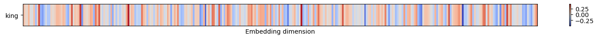
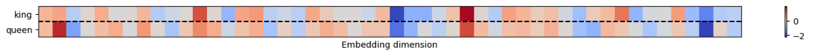
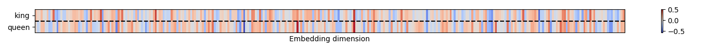
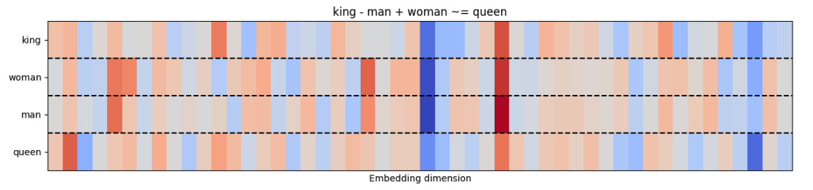
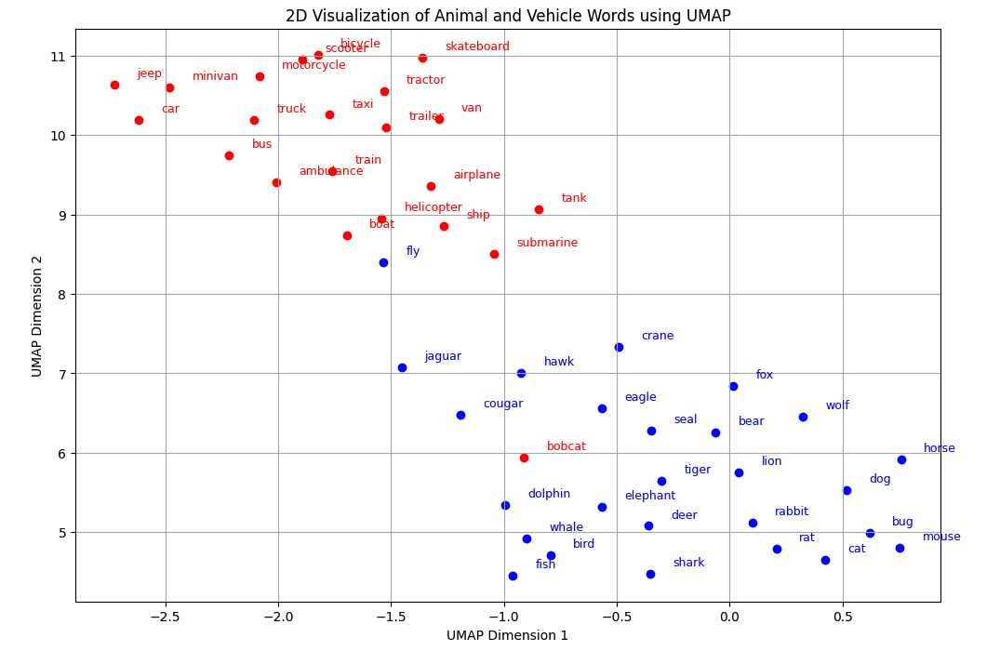

:::::::::::::::::::::::::::::::::::::::::::::::: questions

- What is preprocessing and why do we need it?
- What different types of preprocessing steps are there?
- What are the consequences of applying data preprocessing on our text?

- What are word embeddings?
- What properties word embeddings have?
- What is a word2vec model?
- Can we inspect word embeddings?
- (Optional) How do we train a word2vec model?

:::::::::::::::::::::::::::::::::::::::::::::::: 

:::::::::::::::::::::::::::::::::::::::::::::::: objectives

After following this lesson, learners will be able to:
- Explain what preprocessing means.
- Explain what tokenisation is.
- Perform text cleaning, lowercasing, tokenization, punctuation and stop word removal tokenisation.
- Apply and use a spacy pretrained model.
- Explain ways machines represent words and understand their meaning

- Explain what word embeddings are
- Get familiar with using vectors to represent things
- Compute the cosine similarity to get the most similar words 
- Use Word2vec to return word embeddings
- Extract word embeddings from a pre-trained Word2vec
- Explore properties of word embeddings
- Visualise word embeddings
- Solve analogies
- (Optional) Train your own word2vec model

::::::::::::::::::::::::::::::::::::::::::::::::

# What are word embeddings?

**You shall know a word by the company it keeps** - J. R. Firth, 1957

In this episode, we’ll go over the concept of embedding, and the steps to generate and explore word embeddings with Word2vec. 

We know that computers understand the language of numbers, so in order to let the computer process natural language, we must encode words in a sentence to numbers (i.e., vectors). Ideally, you can "transform" text in numbers in many ways. For instance, take the sentence `the cat sat on the mat`.

We could transform this sentence into a matrix in Python. The matrix will have the number of columns equals to the length of unique words in the corpus (i.e., 5 in our case) and number of words we are encoding (i.e., 6 in this example). 

```python
import numpy as np
import matplotlib.pyplot as plt

sentence = ["the", "cat", "sat", "on", "the","mat"]

words = ["cat", "mat", "on", "sat", "the"]

data = np.array([
    [0, 0, 0, 0, 1],
    [1, 0, 0, 0, 0],
    [0, 0, 0, 1, 0],
    [0, 0, 1, 0, 0],
    [0, 0, 0, 0, 1],
    [0, 1, 0, 0, 0],
])

fig, ax = plt.subplots()

table = ax.table(cellText=data, rowLabels=sentence, colLabels=words, cellLoc='center', loc='center')
ax.axis('off')
plt.title('the cat sat on the mat')
plt.show()
```

and count how many times we encounter a word by putting 1s (present) and 0s (absent). This approach is described as one-hot encoding:


|     | cat | mat | on  | sat | the |
|-----|-----|-----|-----|-----|-----|
| the |  0  |  0  |  0  |  0  |  1  |
| cat |  1  |  0  |  0  |  0  |  0  |
| sat |  0  |  0  |  0  |  1  |  0  |
| on  |  0  |  0  |  1  |  0  |  0  |
| the |  0  |  0  |  0  |  0  |  1  |
| mat |  0  |  1  |  0  |  0  |  0  |


To encode the word `cat` into a vector, you may concatenate each value in the vector cat = [1, 0, 0, 0, 0]. This would give us a unique fingerprint describing the word cat, and differentiating it from the other ones in the sentence. The downside of this approach is that you get a vector that is very sparse, i.e., it will contain a lot of 0s and only very few 1s. For very long documents (imagine billion of words) this approach becomes inefficient very quickly. In addition, we don't get any information about the syntactic and semantic relationship of the words.

Another strategy, is to map each word to a number. This approach is referred to as ordinal encoding:

| cat | mat | on  | sat | the |
|-----|-----|-----|-----|-----|
|   0 |  1  |  2  |  3  |  4  | 

So that the sentence can be mapped as:

```python
sentence = [4, 0, 3, 2, 4, 1]
```

This approach is much more efficient as it links each word to one numeric identifier. However, the choice for this identifier is quite arbitrary -- what does it mean that cat is 0? Does it change anything if it is encoded as 2? Moreover, there is no way to represent the relationship among words, e.g., how `cat`/0 relates to `mat`/1 ? So with this approach we gain in efficiency, but still we don't solve the problem of encoding semantic and syntactic information present in the text.

## Word embeddings

A Word Embedding is a word representation type that maps words in a numerical manner (i.e., into vectors), however, differently from the approaches above, it organises information into an *efficient*, i.e., *dense*, representation in which semantic and syntactic features in the text are preserved. In this representation, words are described in a multidimensional space whereby similar words have a similar encoding. This allows us to describe them fully, and make comparisons among words.

Since word embeddings are essentially vectors, let's see an example to get familiar with the idea of representing things into vectors. We use again the word `cat` and we try to describe this animal based on its characteristics. For instance, its furriness. Let's say that we measured the cat's furriness (in some magical way) and we found out that a cat has a score of `70` in furriness.

{alt=""}


Do you think we have described sufficiently this animal? Perhaps we can add another characteristic: Number of legs.

{alt=""}

We have now at least two characteristics that describe this animal. This is certainly not enough to describe this animal in **full**, however this approximation becomes helpful when we have to compare other animals, such as a dog.

{alt=""}

And what about a caterpillar?

{alt=""}

Which of these two animals (dog vs caterpillar) is more similar to a cat? We can compute the similarity among those vectors with the function `cosine_similarity()` in Python, from the `sklearn` library.

:::: callout

[cosine similarity](https://en.wikipedia.org/wiki/Cosine_similarity) ranges between [`-1` and `1`]. It is the cosine of the angle between two vectors, divided by the product of their length. It is a useful metric to measure how similar two vectors are likely to be.

{alt=""}

:::: 


```python
from sklearn.metrics.pairwise import cosine_similarity

cat = np.asarray([[70, 4]])
dog = np.asarray([[56, 4]])
caterpillar = np.asarray([[70, 100]])

cosine_similarity(cat, dog)

cosine_similarity(cat, caterpillar)

```

Output:

```python
array([[0.9998988]])

array([[0.61926538]])
```

- Cosine similarity between cat and dog: 0.9998988
- Cosine similarity between cat and caterpillar: 0.61926538

So the similarity between a cat and a dog is *higher* than a cat and a caterpillar. Therefore, based on these two traits, we can conclude that a cat is much more similar to a dog than a caterpillar. 

We can of course add other dimensions to describe these animals:

{alt=""}

:::::::::::::::::::: challenge
- Add one of two other dimensions. What characteristics could they map?
- Add another animal and map their dimensions
- Compute again the cosine similarity among those animals and find the couple that is the least similar and the most similar

:::::: solution

1. Add one of two other dimensions

We could add the dimension of "velocity" or "speed" that goes from 0 to 100 meters/second. 

- Caterpillar: 0.001 m/s
- Cat: 1.5 m/s
- Dog: 2.5 m/s

(just as an example, actual speeds may vary)

```python
cat = np.asarray([[70, 4, 1.5]])
dog = np.asarray([[56, 4, 2.5]])
caterpillar = np.asarray([[70, 100, .001]])

```

Another dimension could be weight in Kg:

- Caterpillar: .05 Kg
- Cat: 4 Kg
- Dog: 15 Kg

(just as an example, actual weight may vary)

```python
cat = np.asarray([[70, 4, 1.5, 4]])
dog = np.asarray([[56, 4, 2.5, 15]])
caterpillar = np.asarray([[70, 100, .001, .05]])

```

Then the cosine similarity would be:

```python
cosine_similarity(cat, caterpillar)

cosine_similarity(cat, dog)
```

Output:

```python
array([[0.61814254]])
array([[0.97893809]])
```
2. Add another animal and map their dimensions

Another animal that we could add is the Tarantula!

```python
cat = np.asarray([[70, 4, 1.5, 4]])
dog = np.asarray([[56, 4, 2.5, 15]])
caterpillar = np.asarray([[70, 100, .001, .05]])
tarantula = np.asarray([[80, 6, .1, .3]])
```

3. Compute again the cosine similarity among those animals - find out the most and least similar couple

Given the values above, the least similar couple is the dog and the caterpillar, whose cosine similarity is `array([[0.60855407]])`. 

The most similar couple is the cat and the tarantula: `array([[0.99822302]])`

::::::

::::::::::::::::::::

Once we add multiple dimensions the animals' description become more complex, but also richer, therefore our comparisons become much more precise. 

The downside of this approach is that once we get more than 3 dimensions it becomes very difficult to represent the relationships among words with little arrows. However, the `cosine_similarity()` will always work, regardless of the number of dimensions. 

This example showed us an intuitive way of representing things into vectors. An embedding is after all a way to translate words into vectors. However, this is the extent to which this example tells us something about what word embeddings are. The reason for this is that the way embeddings are constructed is of course not that straight-forward. We'll see how these are built in the next section, whereby we introduce the `word2vec` model.

### Conclusion

In this example we have made our own translation of the word cat, dog and caterpillar into vectors, with dimensions that we chose arbitrarily. Those dimensions were chosen because they were easy to measure and to see with our own eyes. However, when we deal with word embeddings trained on a corpus, it's not clear how words relate their vector structure. That is, it's difficult to know what the dimensions stand for. These can be many (the number must be limited by us) and it's unknown what they map to in the text. 


::::::::::::::::::::::::::::::::::::: keypoints

- We can represent text as vectors of numbers (which makes it interpretable for machines)
- The most efficient and useful way is to use word embeddings
- We can easily compute how words are similar to each other with the cosine similarity
- Dimensions in corpus-based word embeddings are many and not transparent

:::::::::::::::::::::::::::::::::::::

# Word2vec model

Word2Vec is a two-layer neural network that processes raw text and returns us the respective word-vectors (i.e., *word embeddings*). Published in 2013 by Tomas Mikolov et al., it has been one of the most influential deep-learning techniques in NLP. 

To produce word embeddings, the training task of the `word2vec` consists of predicting words. The authors propose two possible ways (and therefore architectures) to solve this task:

- The continuous bag-of-words (CBOW) model: In this architecture, the task consists in predicting the correct target word, given a certain context (words coming before and after the target word). 

- The continuous skip-gram model: In this architecture, the task consists in predicting the correct context words, given a target word.

{alt=""}

In general, CBOW is faster to train, but the Skip-gram is more accurate thanks to its ability to learn infrequent words. In both architectures, increasing the *context size* (i.e., number of context words) leads to better embeddings but also increases the training time.

Regardless of the architecture, however, words that appear in the same context will end up having very similar vectors. Let's now look at the created embeddings.

we have two choices: Train a word2vec model on our own or use a pre-trained one.

Word embeddings become better and better at representing the words (i.e., a word vector becomes more specific) within the text with the size of the training material. Think of all the books, articles, Wikipedia content, and other forms of text data we have lying around. These massive amount of text can be used to train a word2vec model and extract the relative embeddings, which will be particularly informative due to the size of the training input. If we were to train a word2vec model on this amount of data, we would first need the raw text, a powerful machine to process it, and some spare time to wait for the model to complete training. However, luckily for us someone else has done this training already, and we can load the output of this training (i.e., their pretrained word2vec model) on our local machine. 

In this section we are going to look at a pre-trained word2vec model (that is, pre-computed *word embeddings*) and at some of their properties. Towards the end of the section we're going to compare this model with a word2vec model that we trained on our own on a small subset of the Gutenberg books we introduced in the previous episode.

We use the trained word2vec model named `word2vec-google-news-300` from the `gensim` library. This model is trained on a part of the Google News dataset (about 100 billion words). The model contains 300-dimensional vectors for 3 million words and phrases. 

We can download this model locally with this code:

```python
import gensim.downloader
google_vectors = gensim.downloader.load('word2vec-google-news-300')
```

::::::: callout
Note that `gensim` includes various models for word representations, not just `Word2Vec`. These include `FastText`, `Glove`, `ConceptNet`, etc. These methods capture different aspects of word and subword information. 

You can see how many (and which) pretrained model the `gensim` library contains with the following code snippet:

```python
print(list(gensim.downloader.info()['models'].keys()))
```

Output:

```python
['fasttext-wiki-news-subwords-300', 'conceptnet-numberbatch-17-06-300', 'word2vec-ruscorpora-300', 'word2vec-google-news-300', 'glove-wiki-gigaword-50', 'glove-wiki-gigaword-100', 'glove-wiki-gigaword-200', 'glove-wiki-gigaword-300', 'glove-twitter-25', 'glove-twitter-50', 'glove-twitter-100', 'glove-twitter-200', '__testing_word2vec-matrix-synopsis']
```

In the context of this episode we focus on `Word2Vec` only, as this is the most famous.
:::::::

Next, we can look at the embedding of the word `king`:

```python
print(google_vectors['king'])
```

Output:
```python
[ 1.25976562e-01  2.97851562e-02  8.60595703e-03  1.39648438e-01
 -2.56347656e-02 -3.61328125e-02  1.11816406e-01 -1.98242188e-01
  5.12695312e-02  3.63281250e-01 -2.42187500e-01 -3.02734375e-01
 -1.77734375e-01 -2.49023438e-02 -1.67968750e-01 -1.69921875e-01
  3.46679688e-02  5.21850586e-03  4.63867188e-02  1.28906250e-01
  1.36718750e-01  1.12792969e-01  5.95703125e-02  1.36718750e-01
  1.01074219e-01 -1.76757812e-01 -2.51953125e-01  5.98144531e-02
  3.41796875e-01 -3.11279297e-02  1.04492188e-01  6.17675781e-02
  1.24511719e-01  4.00390625e-01 -3.22265625e-01  8.39843750e-02
  3.90625000e-02  5.85937500e-03  7.03125000e-02  1.72851562e-01
  1.38671875e-01 -2.31445312e-01  2.83203125e-01  1.42578125e-01
  3.41796875e-01 -2.39257812e-02 -1.09863281e-01  3.32031250e-02
 -5.46875000e-02  1.53198242e-02 -1.62109375e-01  1.58203125e-01
 -2.59765625e-01  2.01416016e-02 -1.63085938e-01  1.35803223e-03
 -1.44531250e-01 -5.68847656e-02  4.29687500e-02 -2.46582031e-02
  1.85546875e-01  4.47265625e-01  9.58251953e-03  1.31835938e-01
  9.86328125e-02 -1.85546875e-01 -1.00097656e-01 -1.33789062e-01
 -1.25000000e-01  2.83203125e-01  1.23046875e-01  5.32226562e-02
 -1.77734375e-01  8.59375000e-02 -2.18505859e-02  2.05078125e-02
 -1.39648438e-01  2.51464844e-02  1.38671875e-01 -1.05468750e-01
  1.38671875e-01  8.88671875e-02 -7.51953125e-02 -2.13623047e-02
  1.72851562e-01  4.63867188e-02 -2.65625000e-01  8.91113281e-03
  1.49414062e-01  3.78417969e-02  2.38281250e-01 -1.24511719e-01
 -2.17773438e-01 -1.81640625e-01  2.97851562e-02  5.71289062e-02
 -2.89306641e-02  1.24511719e-02  9.66796875e-02 -2.31445312e-01
  5.81054688e-02  6.68945312e-02  7.08007812e-02 -3.08593750e-01
 -2.14843750e-01  1.45507812e-01 -4.27734375e-01 -9.39941406e-03
  1.54296875e-01 -7.66601562e-02  2.89062500e-01  2.77343750e-01
 -4.86373901e-04 -1.36718750e-01  3.24218750e-01 -2.46093750e-01
 -3.03649902e-03 -2.11914062e-01  1.25000000e-01  2.69531250e-01
  2.04101562e-01  8.25195312e-02 -2.01171875e-01 -1.60156250e-01
 -3.78417969e-02 -1.20117188e-01  1.15234375e-01 -4.10156250e-02
 -3.95507812e-02 -8.98437500e-02  6.34765625e-03  2.03125000e-01
  1.86523438e-01  2.73437500e-01  6.29882812e-02  1.41601562e-01
 -9.81445312e-02  1.38671875e-01  1.82617188e-01  1.73828125e-01
  1.73828125e-01 -2.37304688e-01  1.78710938e-01  6.34765625e-02
  2.36328125e-01 -2.08984375e-01  8.74023438e-02 -1.66015625e-01
 -7.91015625e-02  2.43164062e-01 -8.88671875e-02  1.26953125e-01
 -2.16796875e-01 -1.73828125e-01 -3.59375000e-01 -8.25195312e-02
 -6.49414062e-02  5.07812500e-02  1.35742188e-01 -7.47070312e-02
 -1.64062500e-01  1.15356445e-02  4.45312500e-01 -2.15820312e-01
 -1.11328125e-01 -1.92382812e-01  1.70898438e-01 -1.25000000e-01
  2.65502930e-03  1.92382812e-01 -1.74804688e-01  1.39648438e-01
  2.92968750e-01  1.13281250e-01  5.95703125e-02 -6.39648438e-02
  9.96093750e-02 -2.72216797e-02  1.96533203e-02  4.27246094e-02
 -2.46093750e-01  6.39648438e-02 -2.25585938e-01 -1.68945312e-01
  2.89916992e-03  8.20312500e-02  3.41796875e-01  4.32128906e-02
  1.32812500e-01  1.42578125e-01  7.61718750e-02  5.98144531e-02
 -1.19140625e-01  2.74658203e-03 -6.29882812e-02 -2.72216797e-02
 -4.82177734e-03 -8.20312500e-02 -2.49023438e-02 -4.00390625e-01
 -1.06933594e-01  4.24804688e-02  7.76367188e-02 -1.16699219e-01
  7.37304688e-02 -9.22851562e-02  1.07910156e-01  1.58203125e-01
  4.24804688e-02  1.26953125e-01  3.61328125e-02  2.67578125e-01
 -1.01074219e-01 -3.02734375e-01 -5.76171875e-02  5.05371094e-02
  5.26428223e-04 -2.07031250e-01 -1.38671875e-01 -8.97216797e-03
 -2.78320312e-02 -1.41601562e-01  2.07031250e-01 -1.58203125e-01
  1.27929688e-01  1.49414062e-01 -2.24609375e-02 -8.44726562e-02
  1.22558594e-01  2.15820312e-01 -2.13867188e-01 -3.12500000e-01
 -3.73046875e-01  4.08935547e-03  1.07421875e-01  1.06933594e-01
  7.32421875e-02  8.97216797e-03 -3.88183594e-02 -1.29882812e-01
  1.49414062e-01 -2.14843750e-01 -1.83868408e-03  9.91210938e-02
  1.57226562e-01 -1.14257812e-01 -2.05078125e-01  9.91210938e-02
  3.69140625e-01 -1.97265625e-01  3.54003906e-02  1.09375000e-01
  1.31835938e-01  1.66992188e-01  2.35351562e-01  1.04980469e-01
 -4.96093750e-01 -1.64062500e-01 -1.56250000e-01 -5.22460938e-02
  1.03027344e-01  2.43164062e-01 -1.88476562e-01  5.07812500e-02
 -9.37500000e-02 -6.68945312e-02  2.27050781e-02  7.61718750e-02
  2.89062500e-01  3.10546875e-01 -5.37109375e-02  2.28515625e-01
  2.51464844e-02  6.78710938e-02 -1.21093750e-01 -2.15820312e-01
 -2.73437500e-01 -3.07617188e-02 -3.37890625e-01  1.53320312e-01
  2.33398438e-01 -2.08007812e-01  3.73046875e-01  8.20312500e-02
  2.51953125e-01 -7.61718750e-02 -4.66308594e-02 -2.23388672e-02
  2.99072266e-02 -5.93261719e-02 -4.66918945e-03 -2.44140625e-01
 -2.09960938e-01 -2.87109375e-01 -4.54101562e-02 -1.77734375e-01
 -2.79296875e-01 -8.59375000e-02  9.13085938e-02  2.51953125e-01]
```

This vector has 300 entries, i.e., 300 dimensions. We can't say much about what those dimensions map. 
We can represent this vector with a heatmap:

```python
import matplotlib.pyplot as plt
import matplotlib.colors as mcolors

vectors= google_vectors['king']

fig, ax = plt.subplots(1, 1, figsize=(15, 1))

cmap = ax.imshow([vectors], aspect='auto',cmap=plt.cm.coolwarm)
ax.set_yticks([0])
ax.set_xticks([])
ax.set_yticklabels(['king'])
ax.set_xlabel('Embedding dimension')
plt.colorbar(cmap)

plt.tight_layout()

plt.show()

```
{alt=""}


And compare it with other words, like "queen":

```python
vectors= google_vectors['king','queen']


fig, ax = plt.subplots(1, 1, figsize=(15, 1))

cmap = ax.imshow(vectors, aspect='auto',cmap=plt.cm.coolwarm)
ax.set_yticks([0,1])
ax.set_xticks([])
ax.set_yticklabels(['king','queen'])
ax.set_xlabel('Embedding dimension')
plt.axhline(y=.5, c='k', linestyle='--')
plt.colorbar(cmap)

plt.tight_layout()

plt.show()
```

{alt=""}


This visualization shows that the the embeddings for `king` and `queen` share similar values in some dimensions. What do those dimension mean? It's risky to attribute specific features or meanings to individual dimensions based on their values. Individual dimensions in word embeddings are not directly interpretable: The similarities we observe are influenced by the corpus and the hyperparameters used during training. 


:::::::::::::::::::: challenge
Let's explore the dimensions of the embeddings.
Even though we cannot be sure of what the dimensions mean, we can make some hypotheses comparing other embeddings, for similar meanings.

- Add the vectors for ['boy','king','man', 'queen', 'woman', 'girl', 'daughter'] and plot it using the code above
- Compare the vectors by vertically scanning the columns looking for columns with similar colors. What similarities do you see? What characteristics do you think they map?

:::::: solution

1. add vectors ['boy','king','man', 'queen', 'woman', 'girl', 'daughter'] and plot it

```python

vectors= google_vectors['boy', 'king', 'man', 'queen', 'woman', 'girl', 'daughter']

fig, ax = plt.subplots(1, 1, figsize=(15, 3))

cmap = ax.imshow(vectors, aspect='auto',cmap=plt.cm.coolwarm)
ax.set_yticks([0,1,2,3, 4, 5, 6])
ax.set_xticks([])
ax.set_yticklabels(['boy','king','man', 'queen', 'woman', 'girl', 'daughter'])
ax.set_xlabel('Embedding dimension')
plt.axhline(y=.5, c='k', linestyle='--')
plt.axhline(y=1.5, c='k', linestyle='--')
plt.axhline(y=2.5, c='k', linestyle='--')
plt.axhline(y=3.5, c='k', linestyle='--')
plt.axhline(y=4.5, c='k', linestyle='--')
plt.axhline(y=5.5, c='k', linestyle='--')

plt.colorbar(cmap)

plt.tight_layout()

plt.show()
```
2. Compare the vectors by vertically scanning the columns looking for columns with similar colors.

{alt=""}

While we don't know which dimension code for what, we can see that some columns are similar for all words, while other seem to distinguish the characteristic of being royal and gender. We could add more words and get a better understanding of what they code, however ultimately these would be always guesses.

::::::

::::::::::::::::::::

## Analogies
A word analogy is a statement of the type: “*a* is to *b* as *x* is to *y*”, which means that *a* and *x* can be transformed in the same way to get *b* and *y*, respectively. Vice versa, *b* and *y* can be inversely transformed to get *a* and *x*. 

A famous analogy (King - man + woman ~= queen) shows an incredible property of `word2vec` embeddings: That is, since words are encoded as vectors, we can often solve analogies with vector arithmetic. 

Let's consider this in detail:

$$
\overrightarrow{\text{king}} - \overrightarrow{\text{man}} + \overrightarrow{\text{woman}} \approx \overrightarrow{\text{queen}}
$$

Using the `Gensim` library in python, we can translate the above analogy into code:

```python
google_vectors.most_similar(positive=['king', 'woman'], negative=['man'], topn=1)
```

In the line of code above, we have added the word vectors of: $$ \overrightarrow{\text{king}}$$ and: $$\overrightarrow{\text{woman}}$$ and subtracted: $$\overrightarrow{\text{man}}$$ `Topn` was set to 1 to output the most similar (in terms of cosine similarity) word to the resulting vector. 

The output:

```python
[('queen', 0.7118192911148071)]
```

We can visualize this analogy as we did previously:

{alt="Analogy of King - Man + woman ~= Queen"}

This analogy works very well, as it matches our own expectation. However, the match is not 100%, indeed the embedding "queen" is just the closest embedding that this specific pre-trained model has in its vocabulary. That's the reason why we don't use the `=` symbol, but `~=`.

:::::::::::::::::::: challenge

Try other analogies with the code above. Find at least one analogy that works, and another that in your opinion is not exactly what you expected.

:::::: solution

An analogy that works, i.e., it matches my logic:

$$
\overrightarrow{\text{dollar}} - \overrightarrow{\text{US}} + \overrightarrow{\text{Italy}} \approx \overrightarrow{\text{euro}}
$$

```python
google_vectors.most_similar(positive=['dollar', 'Italy'], negative=['US'], topn=1)
```

Output:

```python
[('euro', 0.5166667103767395)]
```

This analogy also works, and it is based on the orthography of the words:

$$
\overrightarrow{\text{apple}} - \overrightarrow{\text{apples}} + \overrightarrow{\text{cars}} \approx \overrightarrow{\text{car}}
$$

```python
google_vectors.most_similar(positive=['apple', 'cars'], negative=['apples'], topn=1)
```

Output:

```python
[('car', 0.696682333946228)]
```

An analogy that doesn't exactly match my expectation:

$$
\overrightarrow{\text{doctor}} - \overrightarrow{\text{hospital}} + \overrightarrow{\text{school}} \approx \overrightarrow{\text{teacher}}
$$

```python
google_vectors.most_similar(positive=['doctor', 'school'], negative=['hospital'], topn=1)
```

Output:

```python
[('guidance_counselor', 0.5969595313072205)]
```

So, in this case this analogy is not solved very well by our model. I expected the model to give me the word `teacher` but instead it gave me `guidance_counselor`.

::::::

::::::::::::::::::::


## Linguistic categories, dimensionality reduction and the challenge of polysemy

In addition to analogies, we can explore how good `word2vec` is in capturing the syntactic and semantic similarity between words (and pairs of words), via the exploration of linguistic categories.

Linguistic categories are groups of words that describe high-level properties that all those words have in common. Consider the following words:

```python
['car', 'truck', 'bus', 'bicycle', 'motorcycle', 'scooter', 'train', 'airplane', 
                 'helicopter', 'boat', 'ship', 'submarine', 'van', 'taxi', 'ambulance', 'tractor', 
                 'trailer', 'jeep', 'minivan', 'skateboard', 'tank', 'bobcat']
```

What do they have in common? They are all `vehicles`. Consider now these words:

```python
['dog', 'cat', 'horse', 'lion', 'tiger', 'elephant', 'bear', 'wolf', 'fox', 'deer', 
                'rabbit', 'mouse', 'rat', 'bird', 'eagle', 'hawk', 'fish', 'shark', 'whale', 'dolphin',
               'fly', 'crane', 'bug','seal','cougar', 'jaguar']
```

All those words belong to the category of `animals`. Let's group those vectors in their respective category labels:

```python
animal_words = ['dog', 'cat', 'horse', 'lion', 'tiger', 'elephant', 'bear', 'wolf', 'fox', 'deer', 
                'rabbit', 'mouse', 'rat', 'bird', 'eagle', 'hawk', 'fish', 'shark', 'whale', 'dolphin',
               'fly', 'crane', 'bug','seal','cougar', 'jaguar']
vehicle_words = ['car', 'truck', 'bus', 'bicycle', 'motorcycle', 'scooter', 'train', 'airplane', 
                 'helicopter', 'boat', 'ship', 'submarine', 'van', 'taxi', 'ambulance', 'tractor', 
                 'trailer', 'jeep', 'minivan', 'skateboard', 'tank', 'bobcat']
```

Let's extract their vectors from our pre-trained word2vec model:

```python
all_words = animal_words + vehicle_words 
word_vectors = np.array([google_vectors[word] for word in all_words])
```

Intuitively, if we were to represent *visually* those categories in a two-dimensional (i.e., 2D) space, we would represent each word as a point in the plot, and separate in space those words belonging to the category of `animal` from those belonging to the category of `vehicles`. To test our intuition against the model, we can plot it.

### Dimensionality reduction

However, a point is made of two coordinate: *x* and *y*, while each word in those categories contains 50 coordinates, one for each dimension. We cannot represent more than e.g., 4 dimensions in our plot (x, y, z and colour). What's the solution then?

We must "squeeze" the dimensions into 2 (x and y). This process is called dimensionality reduction. The idea behind it is to represent a set of high-dimensional vectors as 2D points in such a way that the distances between pairs of points are preserved as much as possible. Of course this will be an approximation, however in most cases is good enough to test our intuition. There are many methods of dimensionality reduction, in this case we use `UMAP` from the homonymous library:

```python
# Reduce dimensions using UMAP
import umap.umap_ as umap

reducer = umap.UMAP(n_neighbors=15, min_dist=0.1, random_state=40)
embedding = reducer.fit_transform(word_vectors)

```

- Setting `n_neighbors` to 15 means UMAP will consider each point in the context of its 15 nearest neighbors. Lower values of `n_neighbors` can capture more local structure, which might be useful for clustering closely related points.

- `min_dist`: This parameter controls how tightly UMAP packs points together. It defines the minimum distance between points in the embedding space. Lower values lead to more tightly packed embeddings, while higher values result in a more spread out embedding. A value of `0.1` allows some flexibility while keeping the embeddings packed.

- Setting `random_state` to 40 ensures that the results are reproducible. This means that each time the code is run with the same data and parameters, the output will be the same.

- `fit_transform` picks the high-dimentional data and transforms it into a lower-dimensional space.

We plot the result of the dimensionality reduction:

```python
plt.figure(figsize=(12, 8))

# animal words
for i, word in enumerate(animal_words_in_vocab):
    plt.scatter(embedding[i, 0], embedding[i, 1], color='blue')
    plt.text(embedding[i, 0] + 0.1, embedding[i, 1] + 0.1, word, fontsize=9, color='blue')

# vehicle words
for i, word in enumerate(vehicle_words_in_vocab, start=len(animal_words_in_vocab)):
    plt.scatter(embedding[i, 0], embedding[i, 1], color='red')
    plt.text(embedding[i, 0] + 0.1, embedding[i, 1] + 0.1, word, fontsize=9, color='red')

plt.title('2D Visualization of Animal and Vehicle Words using UMAP')
plt.xlabel('UMAP Dimension 1')
plt.ylabel('UMAP Dimension 2')
plt.grid(True)
plt.show()
```

{alt=""}

The visualisation confirms our real world knowledge:

1. Words belonging to the animal realm are closer and form a group together. Same for the vehicle words.

2. Those two categories form two clusters, i.e., it would be easy to draw with a pen their perimeter

### Polysemy 

At a closer inspection, however, there is also an interesting phenomenon visible: The words `crane` (for animals) and `bobcat` (for vehicles) are somewhat confused. They are represented closer to the vehicles and animals, respectively. The reason for this "confusion" is due to the fact that `crane` and `bobcat` are polysemous words, i.e., they have multiple meanings. A `cran`e is a large, tall machine used for moving heavy objects and a tall, long-legged, long-necked bird. A bobcat is both a wildcat with a short tail and spotted coat and an excavator used for digging. A vast majority of words, especially frequent ones, are polysemous, with each word taking on anywhere from two to a dozen different senses in many natural languages. We are able to disambiguate words based on the context in which they occur. Word2vec however is not able to do it. The reason for this is that word2vec assigns a single vector to each word regardless of its multiple meanings. This means that all contexts in which a polysemous word appears contribute to a single representation, in which all meanings are blended together.


::::::::::::::::::::::::::::::::::::: keypoints

- We can explore linguistic categories via word2vec by extracting the vectors of words belonging to some category we wish to investigate

- To visualise word embeddings we must reduce their dimensions to 2

- Word2vec does not deal very efficiently with polysemy as it does not allow to extract a different embedding to a word depending on its context
:::::::::::::::::::::::::::::::::::::


# (Optional) Training a word2vec model on our dataset

We import `spacy` for a light pre-processing of the text and nltk to get a subset of the books present in the Gutenberg dataset.

```python
import spacy
import nltk
from nltk.corpus import gutenberg

# this is a log setting, useful for printing during training
logging.basicConfig(format='%(asctime)s : %(levelname)s : %(message)s', level=logging.INFO)

```

::::::: callout

If you haven't installed `spaCy` before, and the proper english model, run the code below from your terminal:

```python
pip install spacy
python -m spacy download en_core_web_sm

```
:::::::

We load the `en_core_web_sm` model.It is a pre-trained statistical model provided by `spaCy` for processing English language text. It includes vocabulary and syntax already.

```python
nlp = spacy.load("en_core_web_sm")
```

We download the books:

```python
nltk.download('gutenberg')
```

Let's take a look at which books we have in this dataset:

```python
available_books = gutenberg.fileids()
```

Output:

```python
available_books

['austen-emma.txt',
 'austen-persuasion.txt',
 'austen-sense.txt',
 'bible-kjv.txt',
 'blake-poems.txt',
 'bryant-stories.txt',
 'burgess-busterbrown.txt',
 'carroll-alice.txt',
 'chesterton-ball.txt',
 'chesterton-brown.txt',
 'chesterton-thursday.txt',
 'edgeworth-parents.txt',
 'melville-moby_dick.txt',
 'milton-paradise.txt',
 'shakespeare-caesar.txt',
 'shakespeare-hamlet.txt',
 'shakespeare-macbeth.txt',
 'whitman-leaves.txt']
```

Some of these books are very big, making the training excessively long. It's best for this exercise to limit ourselves to midium/small size books. In order to do so, we first compute the length of each book, then we subset those that are within 2000000 characters. This is an arbitrary value but for the sake of this exercise it serves our purpose. If we were to train all books from the Gutenberg dataset we would need access to a server a different type of code that deals with allocation of the memory more efficiently.

```python
# Calculate the length of each book
book_lengths = {book: len(nltk.corpus.gutenberg.raw(book)) for book in available_books}

# Print the size of each book
for book, length in book_lengths.items():
    print(f"{book}: {length} characters")
```

We set `npl.max_length` to `2000000` because some books in the Gutenberg libraries are very long. The `nlp.max_length` parameter ensures that they are processed without issues related to document length.

```python
nlp.max_length = 2000000 

```

Now we filter the books that are within our `nlp.max_length`:

```python
# filter books that are less than our max_length
filtered_books = [book for book, length in book_lengths.items() if length <= nlp.max_length]
filtered_books
```

We are ready to preprocess our books and train our word2vec model.

First, preprocess the books. We use an ad-hoc function to tokenize, lowercase, remove stop words and punctuation:

```python
# Function to read and preprocess texts using spaCy
def read_input(book_ids):
    """This method reads the input book IDs and preprocesses the text"""
    
    logging.info("Reading and preprocessing books...this may take a while")
    
    for book_id in book_ids:
        logging.info(f"Reading book {book_id}")
        raw_text = nltk.corpus.gutenberg.raw(book_id)
        doc = nlp(raw_text)
        
        for sentence in doc.sents:
            # Tokenize, lowercase, use lemmatization
            tokens = [token.lemma_.lower() for token in sentence 
            # remove stop words punctuation and words starting with uppercase (to avoid entities), 
                      if not token.is_stop and not token.is_punct and not token.text[0].isupper()]
            if tokens:
                yield tokens
                
```

Then we run it over our dataset:

```python
# Read and preprocess the texts from the selected books
documents = list(read_input(filtered_books))
logging.info("Done reading and preprocessing data")
```

We initialise the word2vec model:

```python
model = gensim.models.Word2Vec(documents, vector_size=50, window=4, min_count=2, workers=4)
```

Note that: 

- By default, the architecture used by `gensim.models.Word2Vec()` is CBOW. You have to explicitly state `sg=1` if you intend to use skip-gram.

- we set `vector_size` to 50. This means that each word will be represented by a 50-dimensional vector in the embedding space. Higher dimensions can capture more semantic nuances but require more computational resources. 

- In addition, we set `window` to 4. This setting ensures that the model consider up to 4 words to the left and 4 words to the right of the target word for context. Larger windows can capture broader context but might introduce noise. 

- We ignore all words with total frequency lower than a predifined threshold by setting `min_count` to 2. This helps to remove infrequent words that may not provide useful information and could potentially introduce noise.

- We set `workers` to 4 to use 4 parallel threads for training. More workers can speed up training on multicore machines.

Now that we are all set, we start training on the polished dataset:

```python
model.train(documents,total_examples=len(documents),epochs=10)
```

We can then explore the embedding space as we did for the `word2vec-google-news-300` model.


:::::::::::::::: challenge

- Try exploring your pre-trained model by re-computing the famous analogy of the king and outputting the first 5 words. Do you find any difference in performance?

- If you ask for the top 10 words most similar to `King` what's the output? 

- How do you explain differences in performance, if any?


:::::: solution

- Reproducing the famous analogy of the `King - man + woman ~= queen`:

```python
model.wv.most_similar(positive=['king', 'woman'], negative=['man'], topn=5)
```

Output:

```python
[('rich', 0.6688281893730164),
 ('brave', 0.6251468062400818),
 ('widow', 0.6215934753417969),
 ('farmer', 0.6200089454650879),
 ('nursery', 0.6171179413795471)]
```

- If you ask for the top 10 words most similar to `King` what's the output? 

```python
# the word most similar to king?
w1 = "king"
model.wv.most_similar(w1, topn=10)
```

Output:

```python
[('queen', 0.6963975429534912),
 ('royal', 0.6770277619361877),
 ('brave', 0.6549012660980225),
 ('evangelist', 0.6369228959083557),
 ('warrior', 0.6366517543792725),
 ('god', 0.6336646676063538),
 ('crop', 0.6331022381782532),
 ('bachelor', 0.6304036974906921),
 ('mystick', 0.6260853409767151),
 ('auction', 0.614545464515686)]
```

- Difference in performance is due to (1) different trained corpus and (2) different size of the corpus. 
::::::
::::::::::::::::

::::::::::::::::::::::::::::::::::::: keypoints

- We can both train or load a pre-trained word2vec model

- Embeddings of a trained model will reflect the statistics of the input dataset

- Loading a (big) pre-trained word2vec model allows us to get embeddings that better reflect the syntactic and semantic relationship among (pairs of) words. Using one or the other will depend on your research question.
:::::::::::::::::::::::::::::::::::::
