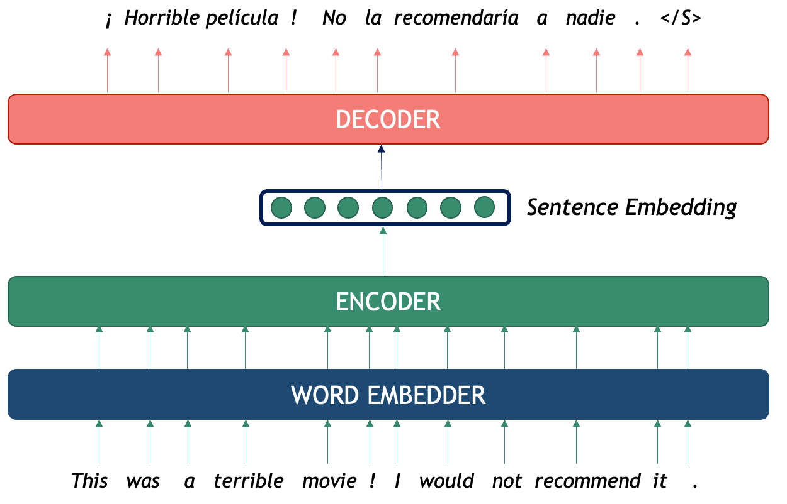
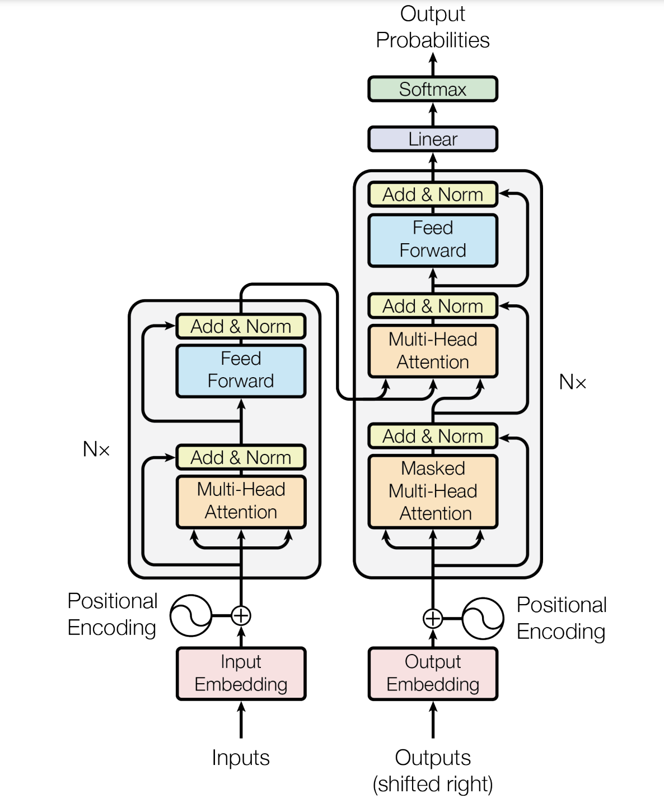

:::::::::::::::::::::::::::::::::::::::::::::::: questions

- What is a Transformer?
- What is BERT and how does it work?
- How can we use BERT to classify text and to classify tokens?
- [OPTIONAL?] How can we fine-tune our own BERT classifier?
- How should we evaluate our models? 

:::::::::::::::::::::::::::::::::::::::::::::::: 

:::::::::::::::::::::::::::::::::::::::::::::::: objectives

After following this lesson, learners will be able to:

- Understand how a Transformer works and recognize their different use cases.
- Use pre-trained transformers language models (e.g. BERT) to classify texts.
- Use a pre-trained transformer Named Entity Recognizer.
- [OPTIONAL?] Fine-tune a BERT classifier with custom data.
- Understand assumptions and basic evaluation for NLP outputs

::::::::::::::::::::::::::::::::::::::::::::::::

# Transformers

Texts can be seen as sequences of sentences and likewise sentences can be seen as sequences of tokens (tokens can be words, punctuation symbols, numbers, or sub-words). Therefore, usually Recurrent Neural Networks (RNNs; and their fancy version, LSTMs) were used to tackle token and sentence classification problems to account for the dependencies inherent to sequence classification. 

The Transformer is a neural network architecture proposed by Google researchers [in 2017](https://arxiv.org/pdf/1706.03762) to address most of the limitations of Recurrent Neural Networks. In their paper, *Attention is all you Need* (we will explain more details on what **attention** means in a minute), they tackled especifically the problem of Machine Translation (MT), which in NLP terms is stated as: how to generate a sentence (sequence of words) in target language B given a sentence in source language A?


## Encoder-Decoder: The Machine Translation Case

The inspiration for the Transformer is indeed the general  MT task, therefore it is easier to understand all of its components if we explain how translation was performed using neural models until 2016. The general architecture is called Encoder-Decoder, which works as follows:

An **encoder** is a recurrent neural network that processes the source sequence and condenses its content into a single vector called *sentence embedding*. This fixed-sized vector is supposed to hold the entire meaning conveyed in the source sequence, no matter how short or long it is. 

Next, a second recurrent neural network is used, the **decoder**, to generate token by token conditioned both on the source meaning and the target words generated so far. This way, each generated tokens should be coherent within the target sequence while at the same time expressing the intended meaning in the source.




## Attention Mechanism

The problem with the pure Encoder-Decoder approach is that a lot of the success of the Decoder is dependent on what the Encoder compressed into a fixed-sized representation, and the access to individual source lexical information is lost. To overcome this problem the **attention mechanism** was introduced in 2015 by [Bahdanau et.al.](https://export.arxiv.org/pdf/1409.0473v7), originally it was a third neural network in between the Encoder and the Decoder, but later more efficient mechanisms were proposed. To *pay attention* means to provide *more probability* to the tokens that can help the decoder to predict a more accurate translation, this probability ditribution is also learned during training.


The whole purpose of the attention mechanism is to model the token-level interactions between the source and the target at every single decoder generation step. For example, to generate the word `movie`, the decoder should *pay more attention* to the source token `pelicula` regardless of the rest of the content source sentence. Likewise, a whole phrase such as `no la recomendaria a nadie` can only be properly generated if the decoder looks at several source tokens, in this case `I would not recomment it`, since there is not really a 1-to-1 mapping when translating across languages.

## Transformer Architecture

Because attention boosted dramatically the performance of Neural Machine Translation systems, the Transformer proposes to prioritize the use of attention to improve performance, while dumping the Recurrent Neural Network architecture, this also helps with parallelizing the process. Here is the global architecture proposed:  



The whole architecture is a stack N encoders with N decoders, each one of them is not a recurrent neural network anymore, but a self-attention mechanism with a linear layer. The term self-attention refers to modelling token-level interactions inside the source sequence itself, which results in emergent token correlations that emulate (to some extent) some syntactic and semantic phenomena of words inside the sequences. This allows the network to improve generalization when generating the vector representations.

Together with self-attention mechanisms, the encoder-decoder attention is preserved, as we described earlier. All of these parallel attention mechanisms and N layers, learn different token-level interactions across the sequences and because of the higher number of layers, together with a huge training corpus, it manages to generalize much better than RNNs with a much smaller training time (which means even more data can be used).


Source of the image [here](https://research.google/blog/transformer-a-novel-neural-network-architecture-for-language-understanding/). To learn more about how the transformer works, [this blogpost](https://jalammar.github.io/illustrated-transformer/) is a good resource.

## Transformer Timeline

Because the Transformer is so good at generalizing sequence data, it is possible to train only Encoder transformers, and use the encoded vector representations as features for classifiers, or use only the Decoder part (which is a network that knows how to generate tokens based on a previous context).

The most kown example of Encoder-only Transformers is BERT (together with the rest of flavours that came later: RoBERTa, ALBERT, XLM, etc) and the most well known Decoder-only is the GPT-x models, and their successors which later became the infamous LLMs (but more on this topic until later!). The following picture shows some of the most used transformer models until 2023:


More on the different flavors of transformers can be read in this [blogpost](https://amatria.in/blog/transformer-models-an-introduction-and-catalog-2d1e9039f376/)

The green models are Encoders, the red ones are Decoders and the purple ones are Encoder-Decoders. For now, however, we will focus on BERT in order to explain with more depth, how to actually make use of the Transformers and to start with the code.

# BERT

[BERT](https://aclanthology.org/N19-1423.pdf) is an acronym that stands for **B**idirectional **E**ncoder **R**epresentations from **T**ransformers. The name describes it all: the idea is to use the power of the transformer architecture to encode text (a sequence of tokens) into vector representations that preserve the contextual meaning of the whole segment. Thanks to the self-attention mechanism, the vector representation of each token takes into account both the left context (what comes before the word) and the right context (what comes after the word), directly addressing the problem of polysemy.

Because of the efficiency of parallel training of transformers it is posible to train these networks on millions of datapoints, improving model generalization. To obtain the BERT vector representations an Encoder is pre-trained with two differnt tasks:
- Masked Language Model: for each sentence, mask one token at a time and predict which token is missing based on the context from both sides.
- Next Sentence Prediction: the Encoder gets a linear binary classifier on top, which is trained to decide for each pair of sequences A and B, if sequence A precedes sequence B in a text.


Already the second pre-training task gives us an idea of the power of this Encoder: after it has been pretrained on hundreds of thoudands of texts, one can plug-in a classifier on top and re-use the *linguistic* knowledge acquired by seeing so much data in order to fine-tune it for a specific task, without needing to learn the weights of the network from scratch. In the next sections we will describe the components of BERT and show how to use it. This model and hundreds of related transformer-based pre-trained encoders can also be found on [Hugging Face](https://huggingface.co/google-bert/bert-base-cased).

## BERT Architecture in a Nutshell


1. Tokenizer: split text into tokens that the model recognizes
2. Embedder: convert each token into a fixed-sized vector that represents it
3. Encoder (with self-Attention): N layers that model the token-level interactions of the input sequence to enhance meaning representation
5. Output Layer: the final layer contains arguably the best token-level representations (like word2vec) that encode syntactic and semantic properties of each token, but this time each vector is contextualized within the specific sequence.
6. *OPTIONAL* Classifier Layer: an additional classifier can be connected on top of the BERT token vectors which are used as features for performing a downstream task. This can be used to classify at the text level, for example sentiment analysis of a sentence, or at the token-level, for example Named Entity Recognition.

## Tokenizer and Embedder

As in any basic NLP pipeline, the first step is to pre-process the raw text so it is ready to be fed into the Transformer. Tokenization in BERT does not happen at the word-level but rather splits texts into what they call WordPieces (the reason for this decision is complex, but in short, researchers found that splitting texts into subtokens exploits better the character sub-sequences inside words and helps the model converge faster). A word then sometimes is decomposed into one or several (sub) tokens. Once the text is tokenized, each token is fed into an embedding layer that transforms the sentence into a sequence of vectors. Additionally, each token is concatenated to two other vectors: one is called segment embedding, which helps recognize if if belongs to segment A/B and the other is the positional embedding wich helps to trace the order of the sequence (remember that the transformer processes data in parallel, hence it looses track of the original word order if it didn't have this positional information).

# 

All of the following code is based on the HugingFace pythonn library. We can install it with:

```sh
pip install transformers
```

We can see how the tokenizer works by loading the correct pre-trained model and tokenizer. Then we feed a sentence into the tokenizer to obtain a tensor of vectors, each one of them representing a wordPiece:

```python
# Load model and tokenizer
from transformers import BertTokenizer, BertModel
tokenizer = BertTokenizer.from_pretrained('bert-base-cased')
model = BertModel.from_pretrained("bert-base-cased")
# Feed text into the tokenizer 
text = "Maria's passion for music is clearly heard in every note and every enchanting melody."
encoded_input = tokenizer(text, return_tensors='pt')
token_ids = list(encoded_input.input_ids[0].detach().numpy())
print(token_ids)
```

This shows a list of 21 token IDs (the ID for each token in the embedding layer of the transformer). To see the actual list of 21 tokens we can convert the IDs like this:

```python
string_tokens = tokenizer.convert_ids_to_tokens(token_ids)
print(string_tokens)
```

We can see that most "words" were converted into a token, however *enchanting* was splitted into three sub-tokens: `'en', '##chan', '##ting'` the hashtags indicate wether a sub-token was part of a bigger word or not, this is useful to recover the original strings later. The `[CLS]` token was added at a beginning and is intended to represent the meaning of the whole sequence, likewise the `[SEP]` token was added to indicate that it is where the sentence ends.

The next step is to we give the sequence of tokens to the Encoder which processes it through all the transformer layers and outputs a sequence of dense vectors, each one of them representing one token piece in the embedded space . The most basic approach is to only retrieve the last layer of the encoder sequence, since it arguably holds the most sintezised information.

```python
output = model(**encoded_input)
print(output.last_hidden_state.shape)
print(output.last_hidden_state[0])
```

Once again we can look at the shape of the output and see that it holds a tensor of `[1, 21, 768]`. The first dimension is the batch size (to process several sequences in parallel), the second dimension is the number of tokens in the sequences and the third dimension is always 768 with BERT since those were the dimensions chosen by the creators of the model. When we print the vectors we only see a lot of fine-tuned weights which are not very informative in their own, but the full-vectors are meaningful withing the space, which emulates some aspects of linguistic meaning. In the case of wanting to obtain a single vector for *enchanting*, you can average the three vectors that belong to the token pieces that ultimately from that word.

We can use the same method to encode another sentence with the word *note* to see how BERT can actually handle polysemy thanks to the representation of each word being contextualized instead of isolated.

```python
# Search for the index of 'note' and obtain its vector from the sequence
note_index_1 = string_tokens.index('note')
note_vector_1 = output.last_hidden_state[0][note_index_1].detach().numpy()
note_token_id_1 = token_ids[note_index_1]


# Encode and then take the 'note' token from the second sentence
note_text_2 = "I could not buy milk in the supermarket because the bank note I wanted to use was fake."
encoded_note_2 = tokenizer(note_text_2, return_tensors='pt')
token_ids = list(encoded_note_2.input_ids[0].detach().numpy())
string_tokens_2 = tokenizer.convert_ids_to_tokens(token_ids)
note_index_2 = string_tokens_2.index('note')
note_vector_2 = model(**encoded_note_2).last_hidden_state[0][note_index_2].detach().numpy()
note_token_id_2 = token_ids[note_index_2]

print(note_index_1, note_token_id_1, string_tokens)
print(note_vector_1[:5])
print(note_index_2, note_token_id_2, string_tokens_2)
print(note_vector_2[:5])
```

We can compute the cosine similarity of the word *note* and the word *note* in the second sentence as confirm that they are two different representations, even when in both cases they have the same token-id and they are the 12th token of the sentence:

```python
from sklearn.metrics.pairwise import cosine_similarity

vector1 = np.array(note_vector_1).reshape(1, -1)
vector2 = np.array(note_vector_2).reshape(1, -1)

similarity = cosine_similarity(vector1, vector2)
print(f"Cosine Similarity 'note' vs 'note': {similarity[0][0]}")
```

# BERT as a Language Model


As mentioned before, one of the main pre-training tasks of BERT is Language Modeling. They model language by masking a token and using the whole context to predict it. We can therefore directly use BERT as a predictor for language completion:

```python
from transformers import pipeline

def pretty_print_outputs(sentences, model_outputs):
    for i, model_out in enumerate(model_outputs):
        print("\n=====\t",sentences[i])
        for label_scores in model_out:
            print(label_scores)


nlp = pipeline(task='fill-mask', model='bert-base-cased', tokenizer='bert-base-cased')
sentences = ['Paris is the [MASK] of France', 'I want to eat a cold [MASK] this afternoon', 'Maria [MASK] Groningen']
model_outputs = nlp(sentences, top_k=5)
pretty_print_outputs(sentences, model_outputs)
```

This prints the top 5 most likely suggestions to complete the sentences. In the first example it shows correctly that the missing token in the first sentence is `capital`, the second example is a bit more ambiguous, but the model at least uses the context to correctly predict a series of items that can be eaten (unfortunately, none of its suggestions sound very tasty); finally, the third example gives almost no information so the model plays it safe and only suggests prepositions or punctuation. This already shows some of the weaknesses of the approach.

# BERT for Text Classification

We can also use Transformer encoders as the base for text classifiers (assigning a label to a whole sentence). With the parameter `task="text_classification"` the `pipeline()` function will load the provided model and add a linear layer on top. This linear layer can be fine-tuned with our own labeled data or we can also load the pre-trained models that are already available in HuggingFace. 


Let's see the example of an emotion classifier based on `RoBERTa` model. This model was fine-tuned in the Go emotions [dataset](https://huggingface.co/datasets/google-research-datasets/go_emotions) which is annotated data taken from English Reddit. The fine-tuned model is called [roberta-base-go_emotions](https://huggingface.co/SamLowe/roberta-base-go_emotions). This model takes a sentence as input and ouputs a probability distribution over 28 possible emotions that are conveyed in the text. For example:

```python

classifier = pipeline(task="text-classification", model="SamLowe/roberta-base-go_emotions", top_k=3)

sentences = ["I am not having a great day", "Maria loves Groningen"]
model_outputs = classifier(sentences)

pretty_print_outputs(sentences, model_outputs)
```

This code outputs the Top-3 emotions that each of the two sentences convey. In this case, the first sentence evokes (in order of likelihood) *dissapointment*, *sadness* and *annoyance*; whereas the second sentence evokes *love*, *neutral* and *approval*. Note however that the likelihood of each prediction decreases dramatically below the top choice, so perhaps this specific classifier is only useful for the top emotion.


# BERT for Token Classification

## Named Entity Recognition

Named Entity Recognition (NER) is the task of recognizing mentions of real-world entities inside a text. The concept of entity includes proper names that unequivocally identify a unique individual (PER), place (LOC), organization (ORG), or object (MISC). Depending on the domain, the concept has been expanded to recognize other unique (and more conveptual) entities such as dates, money, works of art and numeric expressions, etcetera. In terms of NLP, this boils down to classifying each token into a series of labels (PER, LOC, ORG, O). Since a single entity can be expressed with multiple words (e.g. New York) the usual notation used for labeling the text is IOB (**I**nner **O**ut **B**eginnig of entity) notations which identifies the limits of each entity tokens. For example:


This is a typical sequence classification problem where an imput sequence must be fully mapped into an output sequence of labels with unique constraints (for example, there can't be an I-PER label before a B-PER label). Since the labels of the tokens are context dependent a language model such as BERT can be beneficial for a task like NER.

## BERT Token Classifier

Because this is one of the core tasks in NLP, there are dozens of pre-trained NER classifiers in HuggingFace that you can use right away. Since the task is similar to any other task, that is, just add a classification layer on top of a pre-trained transformer you can still use the `pipeline()` function to run the model in your custom data, in this case with `task="ner"`. For example:

```python
from transformers import AutoTokenizer, AutoModelForTokenClassification
from transformers import pipeline

tokenizer = AutoTokenizer.from_pretrained("dslim/bert-base-NER")
model = AutoModelForTokenClassification.from_pretrained("dslim/bert-base-NER")

ner_classifier = pipeline("ner", model=model, tokenizer=tokenizer)
example = "My name is Wolfgang Schmid and I live in Berlin"

ner_results = ner_classifier(example)
for nr in ner_results:
    print(nr)
```

This prints all the entity labels that were found in the provided text. Note that the labels are assigned at the token level (wordPieces), and there is also an indication of the substring in the original sentence where you can recover these entities. You can assume all the rest of the tokens qwere labeled as no-entity, that is `"O"`. To recover the full-word entities you can initialize the pipeline with `aggregation_strategy="simple"`:

```python
ner_classifier = pipeline("ner", model=model, tokenizer=tokenizer, aggregation_strategy="simple")
example = "My name is Wolfgang Schmid and I live in Berlin"

ner_results = ner_classifier(example)
for nr in ner_results:
    print(nr)
```

As you can see, the entities now are given at the Span Leven instead of the Token Level (that is, multiword entities are assigned a single entity label).

The next very important step is to evaluate how does the pre-trained model actually performs in **your dataset**. This is important since the fine-tuned model could be overfitted to other custom benchmarks that do not share the characteristics of your dataset.

## Using a Pre-trained Model on LitBank

Now that you know how to use the NER tagger you can apply it to a custom dataset. We will use the [LitBank](https://github.com/dbamman/litbank) corpus, an annotated dataset of 100 works of English-language fiction to support tasks in natural language processing and the computational humanities. Specifically they have human annotations of entities on these books. We can measure how good is this pre-trained classifier by making the model predict the entities inside the text and them compare the outputs with the humam annotations. The NER portion of the dataset we will use is the tabulated data from [here](https://github.com/dbamman/litbank/tree/master/entities/tsv) and one example looks like this:

| Index 	| Token    	| IOB-1 	| IOB-2 	| IOB-3 	| IOB-4 	|
|-------	|----------	|-------	|-------	|-------	|-------	|
| 1     	| CHAPTER  	| O     	| O     	| O     	| O     	|
| 2     	| I        	| O     	| O     	| O     	| O     	|
| 3     	| In       	| O     	| O     	| O     	| O     	|
| 4     	| Chancery 	| B-FAC 	| O     	| O     	| O     	|
| 5     	| London   	| B-GPE 	| O     	| O     	| O     	|
| 6     	| .        	| O     	| O     	| O     	| O     	|

It contains the information of 4 annotators, this is very useful interannotator agreement, a technique in computational linguistics for validating the correctness and consistency of the dataset. Yes! Humans are wrong too all the time when labeling! For simplicity, we will assume we only have the information from annotator 1  and take that as our ground truth. 

The format of the dataset resembles the conll format, a widely used format in computational linguistics for token-based annotations. Another important aspect to observe is that they have other labels for entities. The pre-trained model we chose only labels PER, LOC, ORG and MISC. We can translate FAC and GPE to LOC label as they are only more fine-grained occurrences of locations which our model should recognize as such. To read the data we can use the following function:

```python

def quick_conll_reader(filepath):
    all_sentences, all_labels = [], []
    sent_txt, sent_lbl = [], []
    gold_label_column = 1
    label_translator = {
        "B-FAC": "B-LOC",
        "I-FAC": "I-LOC",
        "B-GPE": "B-LOC",
        "I-GPE": "I-LOC",
        "B-VEH": "O",
        "I-VEH": "O"
    }
    with open(filepath) as f:
        for line in f.readlines():
            row = line.strip().split("\t")
            if len(row) > 1:
                sent_txt.append(row[0])
                label = row[gold_label_column]
                if label in label_translator:
                    sent_lbl.append(label_translator[label])
                else:
                    sent_lbl.append(label)
            else:
                all_sentences.append(" ".join(sent_txt))
                all_labels.append(sent_lbl)
                sent_txt, sent_lbl = [], []
    return all_sentences, all_labels


sentences, gold_labels = quick_conll_reader("1023_bleak_house_brat.tsv")
print(sentences[0].split(' '))
print(gold_labels[0])
```

This code processes the *Bleak House* book and extracts a list of tokenized sentences (as strings) and a list of IOB Labels corresponding to each token in the sentence. You can see the first sentence and its corresponding list of *gold labels* on this example. Next, we load the NER pre-trained model again and process the sentences to obtain model predictions. The problem here is that the model predictions are lists of dictionaries and we need to post-process them so they are also on IOB-format. We use the get_iob_labels() function to do this conversion. 

```python

def token_to_spans(tokens):
    token2spans = {}
    char_start = 0
    for i, tok in enumerate(tokens):
        tok_end = char_start + len(tok)
        token2spans[i] = (char_start, tok_end)
        char_start = tok_end + 1
    return token2spans


def get_iob_labels(tokenized_sentence, entities):
    # Initialize all labels empty
    iob_labels = ['O'] * len(tokenized_sentence)
    # Get Token <-> Chars Mapping
    tok2spans = token_to_spans(tokenized_sentence)
    start2tok = {v[0]:k for k, v in tok2spans.items()}
    end2tok = {v[1]:k for k, v in tok2spans.items()}
    # Iterate over each entity to populate labels
    for entity in entities:
        label = entity['entity_group']
        if label == "MISC":  # Design choice: Do NOT count MISC entities!
            continue
        token_start = start2tok.get(entity['start'])
        token_end = end2tok.get(entity['end'])
        
        if token_start is not None:
            iob_labels[token_start] = f'B-{label}'
            if token_end is not None:
                for i in range(token_start+1, token_end+1):
                    iob_labels[i] = f'I-{label}'
    
    return iob_labels
```

And we finally apply the model to the sentences that we previously read:

```python

ner_classifier = pipeline("ner", model=model, tokenizer=tokenizer, aggregation_strategy="simple")

ner_results = ner_classifier(sentences)
model_predictions = []
for i, sentence_ner in enumerate(ner_results):
    print(f"\n===== SENTENCE {i+1} =====")
    print('Tokens:', sentences[i].split())
    print('GOLD:', gold_labels[i])
    # Get the IOB labels for the tokenized sentence
    tokenized_sentence = sentences[i].split()
    predicted_iob_labels = get_iob_labels(tokenized_sentence, sentence_ner)
    model_predictions.append(predicted_iob_labels)
    print('MODEL:', predicted_iob_labels)
    for nr in sentence_ner:
        print(f'\t{nr}')

```

For each model prediction we are printing the sentence tokens, the IOB gold labels and the IOB predicitons. Now that the data is in this shape we can perform evaluation.

##  Model Evaluation

To evaluate a token classification model the basic metrics are Precision (of all the labeled words, how many of them are correct), Recall (of the expected gold entities, howe many of them were recognized by the model) and F1 (a harmonic mean of precision and recall that leverages both metrics and shows a unified score of performance). The three metrics range from 0 to 1, also sometimes niromalized from 0 to 100. A score of 0 means everything is wrong, and 100 means everything is correct. Many English NER benchmarks nowadays report scores above the 90 F1 scores, but this does not say anything about the performance in your own dataset.

To perform evaluation in your data

```python

from seqeval.metrics import classification_report
print(classification_report(gold_labels, model_predictions))

```

Since we took a classifier that was not trained for the book domain, the performance is quite poor. The solution in this case is to use another of the great characteristics of BERT: fine-tuning for domain adaptation. It is possible to train your own classifier with relatively small data (given that a lot of linguistic knowledge was already provided during the language modeling pre-training). In the following section we will see how to train your own NER model and use it for predictions.

# Training your own Classifier

First thing we need to do is load the bert-base model with an extra clean classifier which we will finetune using owr dataset...

```python
from transformers import AutoConfig
import torch
# This is to be able to use Mac GPU if available
device = torch.device("mps" if torch.backends.mps.is_available() else "cpu")
# Load Pre-trained Weights
model_config = AutoConfig.from_pretrained("bert-base-cased", num_labels=len(index2label), id2label=index2label, label2id=label2index)                                       
ner_model = (AutoModelForTokenClassification
           .from_pretrained("bert-base-cased", config=model_config)
           .to(device))

label2index = {idx: lbl for idx, lbl in label_vocab.items()}
label2index['IGN'] = -100
index2label = {lbl: idx for idx, lbl in label2index.items()}

```

Given that the BERT tokenizer breaks the sentences into WordPieces and our source data only has the gold labels at the full word level, we need to pre-process the data in order to expand the labels and have a 1-1 mapping that match the BERT tokens...

```python

def expand_labels(sentences, gold_labels, return_tensors = None):
    tokenized_inputs = tokenizer(sentences, padding=True, truncation=True, is_split_into_words=True, return_tensors=return_tensors)
    all_expanded = []
    for idx, label in enumerate(gold_labels):
        word_ids = tokenized_inputs.word_ids(batch_index=idx)
        previous_word_idx = None
        label_ids = []
        for word_idx in word_ids:
            if word_idx is None:
                label_ids.append(-100)
            elif word_idx == previous_word_idx:
                label_str = label[word_idx - 1]
                label_ids.append(label2index[label_str])
            else:
                label_str = label[word_idx]
                label_ids.append(label2index[label_str])
            previous_word_idx = word_idx
        all_expanded.append(label_ids)    
    return tokenized_inputs, all_expanded


tokenized_inputs, all_expanded = expand_labels([s.split() for s in sentences], gold_labels)

print(tokenized_inputs[0])
print(len(all_expanded[0]), all_expanded[0])
```

We also need to track the performance of the model while training so we create a script to properly evlluate the model outputs when compared to the expanded gold labels we obtained:

```python
from transformers import TrainingArguments
from seqeval.metrics import f1_score

def align_predictions(predictions, label_ids):    
    preds = np.argmax(predictions, axis=2)    
    batch_size, seq_len = preds.shape    
    labels_list, preds_list = [], []
    
    for batch_idx in range(batch_size):
        example_labels, example_preds = [], []
        for seq_idx in range(seq_len):
            # Ignore label IDs = -100
            if label_ids[batch_idx, seq_idx] != -100:
                example_labels.append(index2label[label_ids[batch_idx][seq_idx]])
                example_preds.append(index2label[preds[batch_idx][seq_idx]])
            
            labels_list.append(example_labels)
            preds_list.append(example_preds)
    
    return preds_list, labels_list


def compute_metrics(eval_pred):    
    y_pred, y_true = align_predictions(eval_pred.predictions,eval_pred.label_ids)
    return {"f1": f1_score(y_true, y_pred)}


```

Next, we define the dataset so the model puts the tensors on the device and goes through the training loop

```python
import torch

class MyNerDataset(torch.utils.data.Dataset):
    def __init__(self, encodings, labels=None):
        self.encodings = encodings
        self.labels = labels

    def __getitem__(self, idx):
        item = {key: torch.tensor(val[idx]).to(device) for key, val in self.encodings.items()}
        if self.labels:
            item['labels'] = torch.tensor(self.labels[idx]).to(device)
        return item

    def __len__(self):
        if self.labels:
            return len(self.labels)
        else:
            return None
```

We finally run the training loop. We will on purpose overfit the model (since we do not have time to train with more data). So we will use the same book for finetuning BERT and after 6 epochs evaluate how it does on the training data itself.

```python
from transformers import Trainer

test_data = MyNerDataset(tokenized_inputs, all_expanded)
train_data = MyNerDataset(tokenized_inputs, all_expanded)


epochs = 6
batch_size = 8
logging_steps = len(sentences) // batch_size

my_awesome_ner = "my-awesome-bert-ner-model"

training_args = TrainingArguments(
    output_dir=my_awesome_ner, 
    log_level="error", 
    num_train_epochs=epochs,    
    per_device_train_batch_size=batch_size,    
    per_device_eval_batch_size=batch_size, 
    evaluation_strategy="epoch",    
    save_steps=1e6, 
    weight_decay=0.01, 
    learning_rate=1e-4,
    disable_tqdm=False, 
    use_mps_device=True,   # Only if you are in Mac!
    # logging_steps=logging_steps
    )


trainer = Trainer(tokenizer=tokenizer, 
                  model=ner_model,
                  args=training_args, 
                  compute_metrics=compute_metrics,
                  train_dataset=train_data,
                  eval_dataset=test_data,
                  )

trainer.train()
```

And finally the evaluation:

```python
from seqeval.metrics import classification_report

sentences, gold_labels, label_vocab = quick_conll_reader("1023_bleak_house_brat.tsv")

my_loaded_ner_model = f"{my_awesome_ner}/checkpoint-80"
ner_classifier = pipeline(task="ner", model=my_loaded_ner_model, tokenizer=my_loaded_ner_model, aggregation_strategy="simple")
ner_results = ner_classifier(sentences)

model_predictions = []
for i, sentence_ner in enumerate(ner_results):
    print(f"\n===== SENTENCE {i+1} =====")
    print('Tokens:', sentences[i].split())
    print('GOLD:', gold_labels[i])
    # Get the IOB labels for the tokenized sentence
    tokenized_sentence = sentences[i].split()
    predicted_iob_labels = get_iob_labels(tokenized_sentence, sentence_ner)
    model_predictions.append(predicted_iob_labels)
    print('MODEL:', predicted_iob_labels)
    for nr in sentence_ner:
        print(f'\t{nr}')


print(classification_report(gold_labels, model_predictions))
```