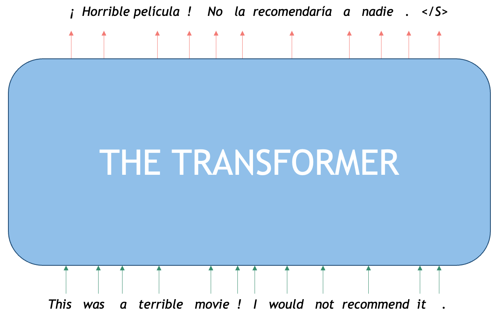
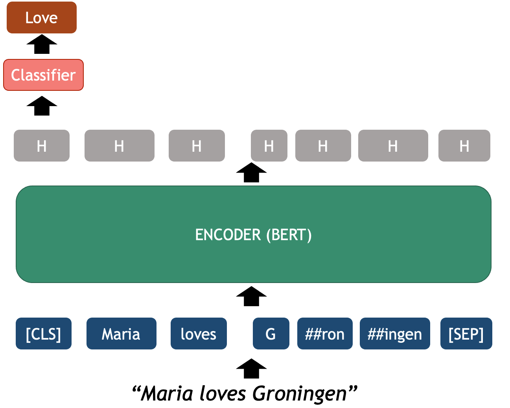
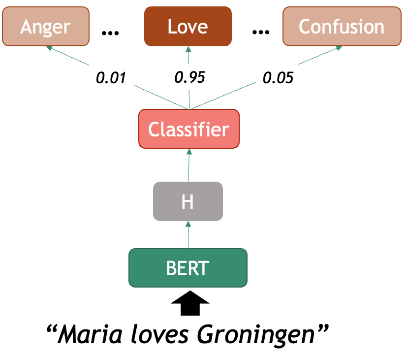
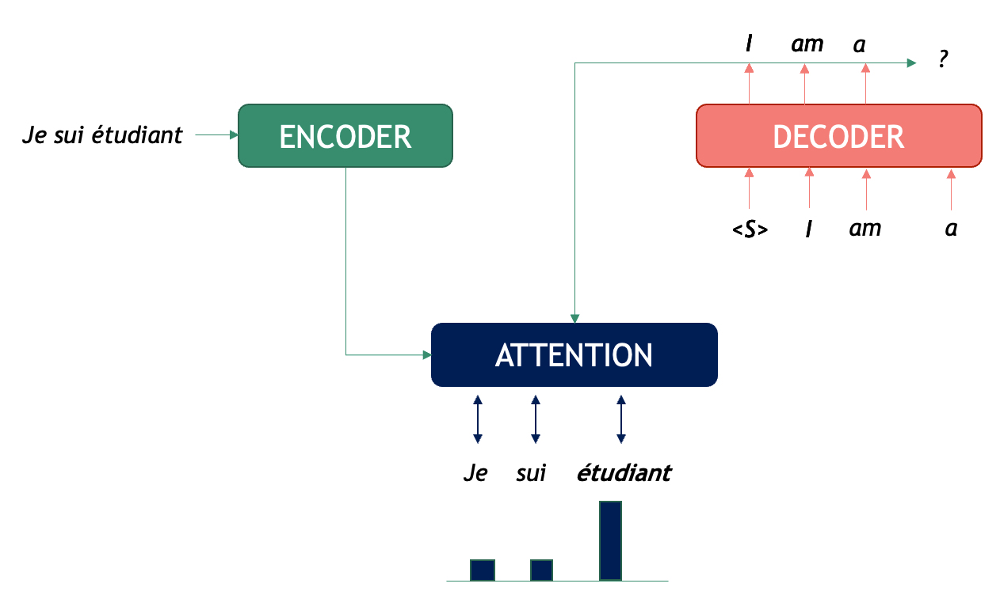
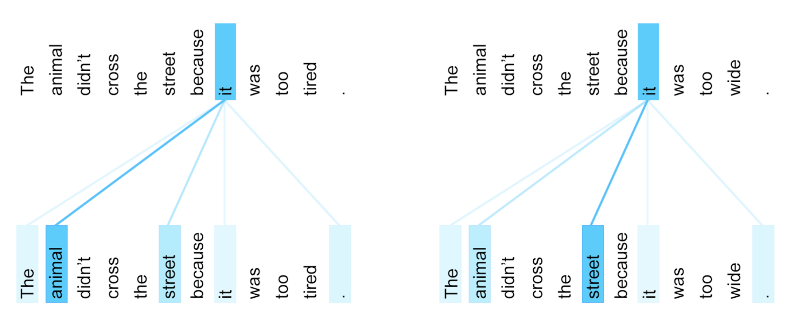
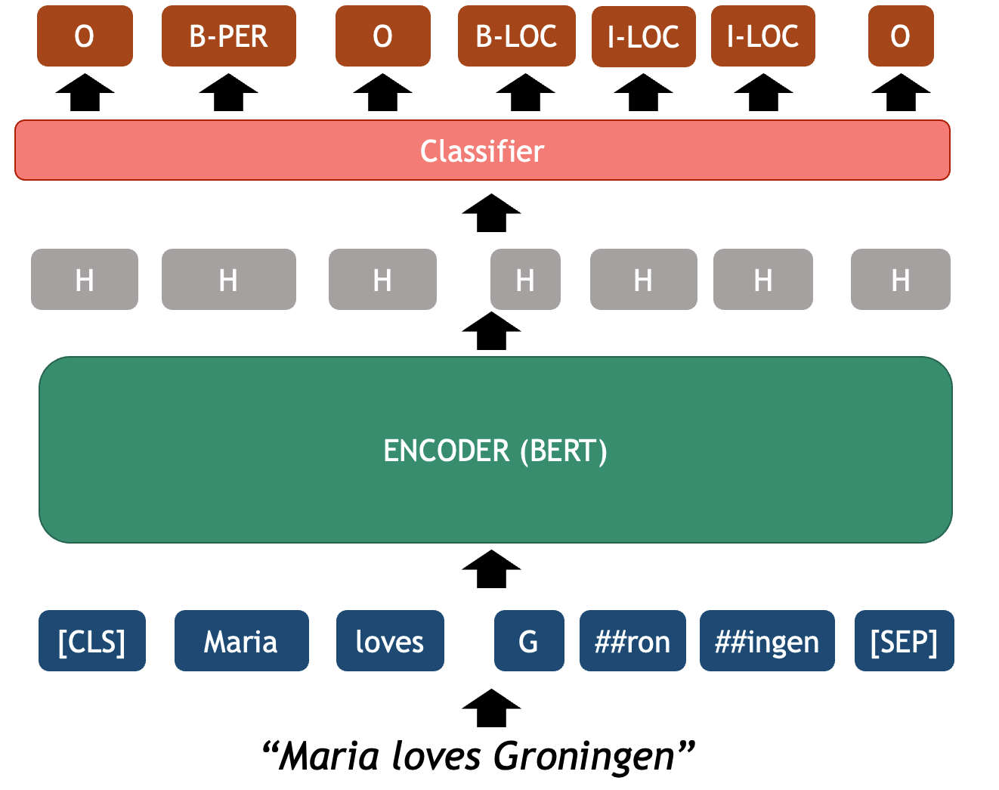

:::::::::::::::::::::::::::::::::::::::::::::::: questions

- What are Transformers?
- What is BERT and how does it work?
- How can I use BERT as a text classifier?
- How should I evaluate my classifiers? 

:::::::::::::::::::::::::::::::::::::::::::::::: 

:::::::::::::::::::::::::::::::::::::::::::::::: objectives

After following this lesson, learners will be able to:

- Understand how a Transformer works and recognize their different use cases.
- Use pre-trained transformers language models (e.g. BERT) to classify texts.
- Use a pre-trained transformer Named Entity Recognizer.
- Understand assumptions and basic evaluation for NLP outputs.

::::::::::::::::::::::::::::::::::::::::::::::::

In the previous lesson we learned how Word2Vec can be used to represent words as vectors. Having these representations allows us to apply operations directly on the vectors that have numerical properties that can be mapped to some syntactic and semantic properties of words; such as the cases of analogies or finding synonyms. Once we transform words into vectors, these can also be used as **features** for classifiers that can be trained predict any supervised NLP task. 

The main drawback of Word2Vec is that each word is represented in isolation, and unfortunately that is not how language works. Words get their meanings based on the specific context in which they are used (take for example polysemy, the cases where the same word can have very different meanings depending on the context); therefore, we would like to have richer vector representations of words that also integrate context into account in order to obtain more powerful representations. 

In 2019, the BERT language model was introduced using a novel architecture called Transformer (2017), which allowed precisely to integrate words' context into representations. To understand BERT, we will first look at what a transformer is and we will then directly use some code to make use of BERT.

# Transformers

Every text can be seen as a sequence of sentences and likewise each sentence can be seen as a sequence of tokens (we use the term _token_ instead of _word_ because it is more general: tokens can be words, punctuation symbols, numbers, or even sub-words). Traditionally Recurrent Neural Networks (RNNs; and later their fancy version, LSTMs) were used to tackle token and sentence classification problems to account for the interdependencies inherent to sequences of symbols (i.e. sentences). RNNs were in theory powerful enough to capture these dependencies, something that is very valuable when dealing with language, but in practice they were resource consuming (both in training time and computational resources) and also the longer the sequences got, the harder it was to capture long-distance dependencies succesfully.

The Transformer is a neural network architecture proposed by Google researchers [in 2017](https://arxiv.org/pdf/1706.03762) to address these and other limitations of RNNs and LSTMs. In their paper, *Attention is all you Need*, they tackled especifically the problem of Machine Translation (MT), which in NLP terms is stated as: how to generate a sentence (sequence of words) in target language B given a sentence in source language A? In order to translate, first one neural network needs to _encode_ the meaning of the source language A into vector representations, and then a second neural network needs to _decode_ that representation into tokens that are understandable in language B. Therefore translation is modeling language B _conditioned_ on what language A originally said.




As seen in the picture, the original Transformer is an Encoder-Decoder network that tackles translation. We first need a token embedder which converts the string of words into a sequence of vectors that the Transformer network can process. The first component, the __Encoder__, is optimized for creating rich representations of the source sequence (in this case an English sentence) while the second one, the __Decoder__ is a generative network that is conditioned on the encoded representation and, with the help of the attention mechanism, generates the most likely token in the target sequence (in this case Dutch words) based on both the tokens generated so far and the full initial English context. 


Next, we will see how BERT exploits the idea of a Transformer Encoder to generate powerful word representations.

# BERT

[BERT](https://aclanthology.org/N19-1423.pdf) is an acronym that stands for **B**idirectional **E**ncoder **R**epresentations from **T**ransformers. The name describes it all: the idea is to use the power of the Encoder component of the Transformer architecture to create powerful token representations that preserve the contextual meaning of the whole input segment. The BERT vector representations of each token take into account both the left context (what comes before the word) and the right context (what comes after the word). Another advantage of the transformer Encoder is that it is parallelizable, which made it posible for the first time to train these networks on millions of datapoints, dramatically improving model generalization. 

::: callout
## Pretraining BERT
To obtain the BERT vector representations the Encoder is pre-trained with two different tasks:
- **Masked Language Model:** for each sentence, mask one token at a time and predict which token is missing based on the context from both sides. A training input example would be "Maria [MASK] Groningen" and the model should predict the word "loves".
- **Next Sentence Prediction:** the Encoder gets a linear binary classifier on top, which is trained to decide for each pair of sequences A and B, if sequence A precedes sequence B in a text. For the sentence pair: "Maria loves Groningen." and "This is a city in the Netherlands." the output of the classifier is "True" and for the pair "Maria loves Groningen." and "It was a tasty cake." the output should be "false" as there is no obvious continuation between the two sentences.

Already the second pre-training task gives us an idea of the power of BERT: after it has been pretrained on hundreds of thoudands of texts, one can plug-in a classifier on top and re-use the *linguistic* knowledge previously acquired to fine-tune it for a specific task, without needing to learn the weights of the whole network from scratch all over again. In the next sections we will describe the components of BERT and show how to use it. This model and hundreds of related transformer-based pre-trained encoders can also be found on [Hugging Face](https://huggingface.co/google-bert/bert-base-cased).
:::

# BERT Architecture

Now that we used the BERT language model component we can dive into the architecture of BERT to understand it better.

As in any basic NLP pipeline, the first step is to pre-process the raw text so it is ready to be fed into the Transformer. Tokenization in BERT does not happen at the word-level but rather splits texts into what they call WordPieces (the reason for this decision is complex, but in short, researchers found that splitting *human words* into *subtokens* exploits better the character sub-sequences inside words and helps the model converge faster). A word then sometimes is decomposed into one or several (sub) tokens.

1. **Tokenizer:** splits text into tokens that the model recognizes
2. **Embedder:** converts each token into a fixed-sized vector that represents it. These vectors are the actual input for the Encoder.
3. **Encoder** several neural layers that model the token-level interactions of the input sequence to enhance meaning representation. The output of the encoder is a set of **H**idden layers, the vector representation of the ingested sequence.
5. **Output Layer:** the final encoder layer (which we depict as a sequence **H**'s in the figure) contains arguably the best token-level representations that encode syntactic and semantic properties of each token, but this time each vector is already contextualized with the  the specific sequence.
6. *OPTIONAL* **Classifier Layer:** an additional classifier can be connected on top of the BERT token vectors which are used as features for performing a downstream task. This can be used to classify at the text level, for example sentiment analysis of a sentence, or at the token-level, for example Named Entity Recognition.


## BERT Code

Let's see how these components can be manipulated with code. For this we will be using the HugingFace's _transformers_ python library. We can install it with:

```sh
pip install transformers
```

The first two main components we need to initialize are the model and tokenizer. The HuggingFace hub contains thousands of models based on a Transformer architecture for dozens of tasks, data domains and also hundreds of languages. Here we will explore the vanilla English BERT which was how everything started. We can initialize this model with the next lines:

```python
from transformers import BertTokenizer, BertModel
tokenizer = BertTokenizer.from_pretrained('bert-base-cased')
model = BertModel.from_pretrained("bert-base-cased")
```

## BERT Tokenizer

We start with a string of text as written in any blog, book, newspaper etcetera. The `tokenizer` object is responsible of splitting the string into recognizable tokens for the model and embedding the tokens into their vector representations

```python
text = "Maria's passion for music is clearly heard in every note and every enchanting melody."
# text = "Maria loves Groningen"
encoded_input = tokenizer(text, return_tensors='pt')
print(encoded_input)
```

The print shows the `encoded_input` object returned by the tokenizer, with its attributes and values. The `input_ids` are the most important output for now, as these are the token IDs recognized by BERT

```
{
    'input_ids': tensor([[  101,  3406,   112,   188,  7615,  1111,  1390, 1110,  3817,  1767, 1107,  1451,  3805,  1105,  1451,  4035, 18546,  1916, 11961,   119, 102]]), 
    'token_type_ids': tensor([[0, 0, 0, 0, 0, 0, 0, 0, 0, 0, 0, 0, 0, 0, 0, 0, 0, 0, 0, 0, 0]]), 
    'attention_mask': tensor([[1, 1, 1, 1, 1, 1, 1, 1, 1, 1, 1, 1, 1, 1, 1, 1, 1, 1, 1, 1, 1]])
}
```

 NOTE: the printing function shows transformers objects as dictionaries; however, to access the attributes, you must use the python object syntax, such as in the following example:

```python
print(encoded_input.input_ids.shape)
```
Output:

`torch.Size([1, 21])`

The output is a 2-dimensional tensor where the first dimention contains 1 element (this dimension represents the batch size), and the second dimension contains 21 elements which are equivalent to the 21 tokens that BERT generated with our string input.

::: callout

You noticed tin the previous outputs the `tensor()` and `torch()` wrappers around the arrays of integers. This is showing that the `transformers` library uses `pytorch` underneath, one of the most popular libraries for Deep Learning in Python. Pytorch's basic unit is the Tensor.

A *tensor* is a generalization for multidimentional array data. By convention, a vector is a 1-dimensional sequence of scalar numbers (or a 1-dim tensor), a matrix is a 2-dimensional sequence (2-dim tensor) and for N-dimensions where N > 2 we use the concept of tensor.

:::

In order to see what these Token IDs represent, we can _translate_ them into human readable strings. This includes converting the tensors into numpy arrays and converting each ID into its string representation:

```python
token_ids = list(encoded_input.input_ids[0].detach().numpy())
string_tokens = tokenizer.convert_ids_to_tokens(token_ids)
print("IDs:", token_ids)
print("TOKENS:", string_tokens)
```

`IDs: [101, 3406, 112, 188, 7615, 1111, 1390, 1110, 3817, 1767, 1107, 1451, 3805, 1105, 1451, 4035, 18546, 1916, 11961, 119, 102]`

`TOKENS: ['[CLS]', 'Maria', "'", 's', 'passion', 'for', 'music', 'is', 'clearly', 'heard', 'in', 'every', 'note', 'and', 'every', 'en', '##chan', '##ting', 'melody', '.', '[SEP]']`

These show us the WordPieces that the BERT Encoder will receive and process. The encoder actually just needs the IDs to retrieve the embedding from its vocabulary, the string representations are just for the human reader.

## BERT Output Object

To give a forward pass of the Encoder and obtain the vector representations, we pass the `encoded_input` object generated by the tokenizer.

```python
output = model(**encoded_input)
print(output)
```
The `output` variable in this case stores an ModelOutput object, which contains a handful of values:

```
BaseModelOutputWithPoolingAndCrossAttentions(
    last_hidden_state=tensor([[
        [-0.0538, -0.1110, -0.0882,  ..., -0.0252,  0.3524,  0.0407],
        [ 0.0814, -0.4825,  0.8327,  ...,  0.3548, -0.1697,  0.0871],
        [-0.2964, -0.1967,  0.3091,  ...,  0.5346,  0.4037, -0.1648],
        ...
    ]]),
    pooler_output=tensor([[-7.2911e-01,  4.2630e-01,  9.9979e-01, -9.9045e-01,  9.3354e-01, ..., 7.7559e-01,  9.8086e-01
    ]]),
    hidden_states=None, 
    past_key_values=None, 
    attentions=None, 
    cross_attentions=None
)
```

We must focus for now on the `last_hidden_state` field, which contains the last layer vector of weights for each token, arguably the best contextualized representation of the token. 

```python
print(output.last_hidden_state.shape)
```
`torch.Size([1, 21, 768])`

When we print the shape of this field, we obtain again a Pytorch Tensor `torch.Size([1, 21, 768])`: the first dimension is the batch size, the second is the number of tokens (we have 21 tokens for this example as seen before), and the third, the dimensionality of the vectors. In the case of BERT-base each token vector always has a shape of 768. As opposed to the previous tensor, each of the 21 tokens are not just one integer anymore, but a whole vector of weights, hence the 3-dimensionality of the tensor.

::: callout

When running examples in a BERT pre-trained model, it is advisable to wrap your code inside a `torch.no_grad():` context. This is linked to the fact that BERT is a Neural Network that has been trained (and can be further finetuned) with the Backpropagation algorithm. Essentially, this wrapper tells the model that we are not in training mode, and we are not interested in _updating_ the weights (as it would happen when training any neural network), because the weights are already optimal enough. By using this wrapper, we make the model more efficient as it does not need to calculate the gradients for an eventual backpropagation step, since we are only interested in what _comes out_ of the Encoder. So the previous code can be made more efficient like this:

```python
import torch 

with torch.no_grad():
    output = model(**encoded_input)
    print(output)
    print(output.last_hidden_state.shape)
```

:::


# BERT as a Language Model

Now that we know hoe to embedd and run the model for obtaining the representations we can test the code for our first NLP Task: Language Modelling (LM). As mentioned before, the main pre-training task of BERT is, LM; in general this is the task of calculating the probability of a word based on the known neighboring words (yes, Word2Vec was also a kind of LM). Obtaining training data for this task is very cheap, as all we need is millions of sentences from existing texts, without any labels. In this setting, BERT encodes a sequence of words, and predicts from a set of English tokens, what is the most likely token that could be inserted in the `[MASK]` position


We can therefore start using BERT as a predictor for word completion, and the word can be in any position inside the sentence. We will also learn here how to use the `pipeline` object, this is very useful when we only want to use a pre-trained model for predictions (no need to fine-tune). The `pipeline` will internally initialize both model and tokenizer for us. In this case again we use `bert-base-cased`, which refers to the vanilla BERT English model. Once we declared a pipeline, we can feed it with sentences that contain one masked token at a time (beware that BERT can only predict one word at a time, since that was its training scheme). For example:


```python
from transformers import pipeline

def pretty_print_outputs(sentences, model_outputs):
    for i, model_out in enumerate(model_outputs):
        print("\n=====\t",sentences[i])
        for label_scores in model_out:
            print(label_scores)


nlp = pipeline(task='fill-mask', model='bert-base-cased', tokenizer='bert-base-cased')
sentences = ['Paris is the [MASK] of France', 'I want to eat a cold [MASK] this afternoon', 'Maria [MASK] Groningen']
model_outputs = nlp(sentences, top_k=5)
pretty_print_outputs(sentences, model_outputs)
```

```
=====	 Paris is the [MASK] of France
{'score': 0.9807965755462646, 'token': 2364, 'token_str': 'capital', 'sequence': 'Paris is the capital of France'}
{'score': 0.004513159394264221, 'token': 6299, 'token_str': 'Capital', 'sequence': 'Paris is the Capital of France'}
{'score': 0.004281804896891117, 'token': 2057, 'token_str': 'center', 'sequence': 'Paris is the center of France'}
{'score': 0.002848200500011444, 'token': 2642, 'token_str': 'centre', 'sequence': 'Paris is the centre of France'}
{'score': 0.0022805952467024326, 'token': 1331, 'token_str': 'city', 'sequence': 'Paris is the city of France'}

=====	 I want to eat a cold [MASK] this afternoon
{'score': 0.19168031215667725, 'token': 13473, 'token_str': 'pizza', 'sequence': 'I want to eat a cold pizza this afternoon'}
{'score': 0.14800849556922913, 'token': 25138, 'token_str': 'turkey', 'sequence': 'I want to eat a cold turkey this afternoon'}
{'score': 0.14620967209339142, 'token': 14327, 'token_str': 'sandwich', 'sequence': 'I want to eat a cold sandwich this afternoon'}
{'score': 0.09997560828924179, 'token': 5953, 'token_str': 'lunch', 'sequence': 'I want to eat a cold lunch this afternoon'}
{'score': 0.06001955270767212, 'token': 4014, 'token_str': 'dinner', 'sequence': 'I want to eat a cold dinner this afternoon'}

=====	 Maria [MASK] Groningen
{'score': 0.24399833381175995, 'token': 117, 'token_str': ',', 'sequence': 'Maria, Groningen'}
{'score': 0.12300779670476913, 'token': 1104, 'token_str': 'of', 'sequence': 'Maria of Groningen'}
{'score': 0.11991506069898605, 'token': 1107, 'token_str': 'in', 'sequence': 'Maria in Groningen'}
{'score': 0.07722211629152298, 'token': 1306, 'token_str': '##m', 'sequence': 'Mariam Groningen'}
{'score': 0.0632941722869873, 'token': 118, 'token_str': '-', 'sequence': 'Maria - Groningen'}

```

When we call the `nlp` pipeline, requesting to return the `top_k` most likely suggestions to complete the provided sentences (in this case `k=5`). The pipeline returns a list of outputs as python dictionaries. Depending on the task, the fields of the dictionary will differ. In this case, the `fill-mask` task returns a score (between 0 and 1, the higher the score the more likely the token is), a tokenId, and its corresponding string, as well as the full "unmasked" sequence. 

In the list of outputs we can observe: the first example shows correctly that the missing token in the first sentence is _capital_, the second example is a bit more ambiguous, but the model at least uses the context to correctly predict a series of items that can be eaten (unfortunately, none of its suggestions sound very tasty); finally, the third example gives almost no useful context so the model plays it safe and only suggests prepositions or punctuation. This already shows some of the weaknesses of the approach.

We will next see the case of combining BERT with a classifier on top.


# BERT for Text Classification

The task of text classification is assigning a label to a whole sequence of tokens, for example a sentence. With the parameter `task="text_classification"` the `pipeline()` function will load the base model and automatically add a linear layer with a softmax on top. This layer can be fine-tuned with our own labeled data or we can also directly load the fully pre-trained text classification models that are already available in HuggingFace.





Let's see the example of a ready pre-trained emotion classifier based on `RoBERTa` model. This model was fine-tuned in the Go emotions [dataset](https://huggingface.co/datasets/google-research-datasets/go_emotions), taken from English Reddit and labeled for 28 different emotions at the sentence level. The fine-tuned model is called [roberta-base-go_emotions](https://huggingface.co/SamLowe/roberta-base-go_emotions). This model takes a sentence as input and ouputs a probability distribution over the 28 possible emotions that might be conveyed in the text. For example:

```python

classifier = pipeline(task="text-classification", model="SamLowe/roberta-base-go_emotions", top_k=3)

sentences = ["I am not having a great day", "Maria loves Groningen"]
model_outputs = classifier(sentences)

pretty_print_outputs(sentences, model_outputs)
```

```
=====	 I am not having a great day
{'label': 'disappointment', 'score': 0.46669483184814453}
{'label': 'sadness', 'score': 0.39849498867988586}
{'label': 'annoyance', 'score': 0.06806594133377075}

=====	 This is a lovely and innocent sentence
{'label': 'admiration', 'score': 0.6457845568656921}
{'label': 'approval', 'score': 0.5112180113792419}
{'label': 'love', 'score': 0.09214121848344803}

=====	 Maria loves Groningen
{'label': 'love', 'score': 0.8922032117843628}
{'label': 'neutral', 'score': 0.10132959485054016}
{'label': 'approval', 'score': 0.02525361441075802}
```

This code outputs again a list of dictionaries with the `top-k` (`k=3`) emotions that each of the two sentences convey. In this case, the first sentence evokes (in order of likelihood) *dissapointment*, *sadness* and *annoyance*; whereas the second sentence evokes *love*, *neutral* and *approval*. Note however that the likelihood of each prediction decreases dramatically below the top choice, so perhaps this specific classifier is only useful for the top emotion.

::: callout

Finetunning BERT is very cheap, because we only need to train the _classifier_ layer,  a very small neural network, that can learn to choose between the classes (labels) for your custom classification problem, without needing a big amount of annotated data. This classifier is just a one-layer neural layer with a softmax that assigns a score that can be translated to the probability over a set of labels, given the input features provided by BERT, which _encodes_ the meaning of the entire sequence in its hidden states.

:::





# Understanding BERT Architecture

This will help to understand some of the strengths and weaknesses of using BERT-based classifiers.

## Tokenizer and Embedder

Let's revisit the tokenizer to better grasp how it is working. The tokenization step might seem trivial but in reality models' tokenizers might make a big difference in the end results of your classifiers, depending on the task you are trying to solve. Understanding the tokenizer of each model (as well as the model type!) can save us a lot of debugging when we work on our custom data.

We will feed again a sentence into the tokenizer to observe how it outputs a sequence of vectors (also called a *tensor*: by convention, a vector is a sequence of scalar numbers, a matrix is a 2-dimensional sequence and a tensor is a N-dimensional sequence of numbers), each one of them representing a wordPiece:

```python

# Feed text into the tokenizer 
text = "Maria's passion for music is clearly heard in every note and every enchanting melody."
encoded_input = tokenizer(text, return_tensors='pt')
token_ids = list(encoded_input.input_ids[0].detach().numpy())
string_tokens = tokenizer.convert_ids_to_tokens(token_ids)
print(string_tokens)

```

As we saw before, this shows a list of 21 token IDs (the ID identifies each token in the embedding layer of the transformer). 

When inspecting the string tokens, we see that most "words" were converted into a single token, however *enchanting* was splitted into three sub-tokens: `'en', '##chan', '##ting'` the hashtags indicate wether a sub-token was part of a bigger word or not, this is useful to recover the human-readable strings later. The `[CLS]` token was added at a beginning and is intended to represent the meaning of the whole sequence, likewise the `[SEP]` token was added to indicate that it is where the sentence ends.

The next step is to give the sequence of tokens to the Encoder which processes it through the transformer layers and outputs a sequence of dense vectors:

```python
with torch.no_grad():
    output = model(**encoded_input)
    print(output.last_hidden_state[0])
```

When we print the vectors we only see a lot of fine-tuned weights which are not very informative in their own, but the full-vectors are meaningful within the embedding space, which emulates some aspects of linguistic meaning. In the case of wanting to obtain a single vector for *enchanting*, you can average the three vectors that belong to the token pieces that ultimately from that word.

We can use the same method to encode another two sentences containing the word *note* to see how BERT actually handles polysemy (*note* means something very different in each sentence) thanks to the representation of each word being contextualized instead of isolated.


```python
# Search for the index of 'note' and obtain its vector from the sequence
note_index_1 = string_tokens.index('note')
note_vector_1 = output.last_hidden_state[0][note_index_1].detach().numpy()
note_token_id_1 = token_ids[note_index_1]

print(note_index_1, note_token_id_1, string_tokens)
print(note_vector_1[:5])
```
We are basically printing the tokenized sentence from the previous exaple and shoging the index of the token `note` in the list of tokens. We are also printing the tokenID assigned to this token and the list of tokens. Finally, the last print shows the first five dimensions of the vector representing the token `note`.
```
12 3805 ['[CLS]', 'Maria', "'", 's', 'passion', 'for', 'music', 'is', 'clearly', 'heard', 'in', 'every', 'note', 'and', 'every', 'en', '##chan', '##ting', 'melody', '.', '[SEP]']
[0.15780845 0.38866335 0.41498923 0.03389652 0.40278202]
```

Let's encode now another sentence, also containing the word `note`, and confirm that the same token string, with the same assigned tokenID holds a vector with different weights:

```python
# Encode and then take the 'note' token from the second sentence
note_text_2 = "I could not buy milk in the supermarket because the bank note I wanted to use was fake."
encoded_note_2 = tokenizer(note_text_2, return_tensors='pt')
token_ids = list(encoded_note_2.input_ids[0].detach().numpy())
string_tokens_2 = tokenizer.convert_ids_to_tokens(token_ids)

note_index_2 = string_tokens_2.index('note')
note_vector_2 = model(**encoded_note_2).last_hidden_state[0][note_index_2].detach().numpy()
note_token_id_2 = token_ids[note_index_2]

print(note_index_2, note_token_id_2, string_tokens_2)
print(note_vector_2[:5])
```

```
12 3805 ['[CLS]', 'I', 'could', 'not', 'buy', 'milk', 'in', 'the', 'supermarket', 'because', 'the', 'bank', 'note', 'I', 'wanted', 'to', 'use', 'was', 'fake', '.', '[SEP]']
[ 0.5003222   0.653664    0.22919582 -0.32637975  0.52929205]
```


To be sure, we can compute the cosine similarity of the word *note* in the first sentence and the word *note* in the second sentence confirming that they are indeed two different representations, even when in both cases they have the same token-id and they are the 12th token of the sentence:

```python
from sklearn.metrics.pairwise import cosine_similarity

vector1 = np.array(note_vector_1).reshape(1, -1)
vector2 = np.array(note_vector_2).reshape(1, -1)

similarity = cosine_similarity(vector1, vector2)
print(f"Cosine Similarity 'note' vs 'note': {similarity[0][0]}")
```

With this small experiment, we have confirmed that the Encoder produces context-dependent word representations, ass opposed to Word2Vec, where *note* would always have the same vector no matter where it appeared.


## The Attention Mechanism

The original attention mechanism (remember this was developed for language translation) is a component in between the Encoder and the Decoder that helps the model to _align_ the important information from the input sequence in order to generate a more accurate token in the output sequence:




In the example above, the attention puts more weight in the input _etudiant_, so the decoder uses that information to _know_ that is should generate _student_. Note that if the decoder based it's next work probability just based in the sequence "I am a ..." it could basically generate any word and still sound natural, but it is thanks to the attention mechanism that it preserves the meaning of the input sequence.

Attention is a neural layer, therefore it can also be plugged-in within the Encoder, this is called **self-attention** since the mechanism will look at the interactions between the input sequence itself (measure inportance between input sequence tokens vs input sequence tokens). This is how BERT uses (self-) attention, which is very useful to capture longer-range word dependencies such as correference, where, for example, a pronoun can be linked to the noun it refers to previously in the same sentence. See the following example:




There are two sentences, in each one the pronoun "it" refers to a different noun, "animal" or "street", and this is completely depending on the sentence context. Thanks to the self-attention BERT relates the pronoun to its relevant correferent.

For this reason BERT is not only useful as a text classifier but also for individual token classification tasks.

# BERT for Token Classification

Just as we plugged in a trainable text classifier layer, we can add a token-level classifier that assigns a class to each of the tokens encoded by a transformer (as opposed to one label for the whole sequence). A specific example of this task is Named Entity Recognition, but you can basically define any task that requires to *highlight* sub-strings of text and classify them using this technique.

## Named Entity Recognition

Named Entity Recognition (NER) is the task of recognizing mentions of real-world entities inside a text. The concept of **Entity** includes proper names that unequivocally identify a unique individual (PER), place (LOC), organization (ORG), or other object/name (MISC). Depending on the domain, the concept can expanded to recognize other unique (and more conceptual) entities such as DATE, MONEY, WORK_OF_ART, DISEASE, PROTEIN_TYPE, etcetera... 

In terms of NLP, this boils down to classifying each token into a series of labels (`PER`, `LOC`, `ORG`, `O`[no-entity] ). Since a single entity can be expressed with multiple words (e.g. New York) the usual notation used for labeling the text is IOB (**I**nner **O**ut **B**eginnig of entity) notations which identifies the limits of each entity tokens. For example:




This is a typical sequence classification problem where an imput sequence must be fully mapped into an output sequence of labels with global constraints (for example, there can't be an inner I-LOC label before a beginning B-LOC label). Since the labels of the tokens are context dependent, a language model with attention mechanism such as BERT is very beneficial for a task like NER.

Because this is one of the core tasks in NLP, there are dozens of pre-trained NER classifiers in HuggingFace that you can use right away. We use once again the `pipeline()` to run the model for predictions in your custom data, in this case with `task="ner"`. For example:

```python
from transformers import AutoTokenizer, AutoModelForTokenClassification
from transformers import pipeline

tokenizer = AutoTokenizer.from_pretrained("dslim/bert-base-NER")
model = AutoModelForTokenClassification.from_pretrained("dslim/bert-base-NER")

ner_classifier = pipeline("token-classification", model=model, tokenizer=tokenizer)
example = "My name is Wolfgang Schmid and I live in Berlin"

ner_results = ner_classifier(example)
for nr in ner_results:
    print(nr)
```

The code prints the following:

```
{'entity': 'B-PER', 'score': 0.9996068, 'index': 4, 'word': 'Wolfgang', 'start': 11, 'end': 19}
{'entity': 'I-PER', 'score': 0.999582, 'index': 5, 'word': 'Sc', 'start': 20, 'end': 22}
{'entity': 'I-PER', 'score': 0.9990482, 'index': 6, 'word': '##hm', 'start': 22, 'end': 24}
{'entity': 'I-PER', 'score': 0.9951691, 'index': 7, 'word': '##id', 'start': 24, 'end': 26}
{'entity': 'B-LOC', 'score': 0.99956733, 'index': 12, 'word': 'Berlin', 'start': 41, 'end': 47}
```

In this case the output of the pipeline is a list of dictionaries, each one representing only entity `IOB` labels at the BERT token level. IMPORTANT: this list is per wordPiece and NOT per *human word* even if the provided text is pre-tokenized. You can assume all of the tokens that don't appear in the output were labeled as no-entity, that is `"O"`. To recover the full-word entities you can initialize the pipeline with `aggregation_strategy="first"`:

```python
ner_classifier = pipeline("token-classification", model=model, tokenizer=tokenizer, aggregation_strategy="first")
example = "My name is Wolfgang Schmid and I live in Berlin"

ner_results = ner_classifier(example)
for nr in ner_results:
    print(nr)
```
The code now prints the following:
```
{'entity_group': 'PER', 'score': 0.9995944, 'word': 'Wolfgang Schmid', 'start': 11, 'end': 26}
{'entity_group': 'LOC', 'score': 0.99956733, 'word': 'Berlin', 'start': 41, 'end': 47}
```


As you can see, entities aggregated at the Span Leven (instead of the Token Level). Word pieces are merged back into *human words* and also multiword entities are assigned a single entity label unifying the `IOB` labels into one. Depending on your use case you can request the pipeline to give different `aggregation_strateg[ies]`. More info about the pipeline can be found [here](https://huggingface.co/docs/transformers/main_classes/pipelines).

The next step is crucial: evaluate how does the pre-trained model actually performs in **your dataset**. This is important since the fine-tuned model could be overfitted to other custom benchmarks that do not share the characteristics of your dataset.

To observe this, we can first see the performance on the test portion of the dataset in which this classifier was trained, and then evaluate the same pre-trained classifier on a NER dataset form a different domain.

# ---------- END HERE ??? ----------


The rest is more advanced content (still I leave it here just in case for now).

## Testing on CoNLL-03 Benchmark

This model was trained on the CoNLL-03 dataset, therefore we can corroborate how it performs using the test portion of this dataset. To get the data we can use the `datasets` library which is also part of theHuggingFace landscape

```
pip install datasets
```

```python
from datasets import load_dataset

conll03_data = load_dataset("eriktks/conll2003", split="test", trust_remote_code=True)
conll03_data
```
This shows the features and number of records of the CoNLL-03 Dataset. Next we can observe which labels we have in the data

```python
conll03_data.features['ner_tags']
```

As expected, the labels are in IOB notation, where each label corresponds to one word in the dataset, however the dataset contains the labelIDs and we need to map them to their string representations. We can double check this by looking at one of the records of the dataset:

```python
def labelid2str(label_int):
    d = conll03_data.features['ner_tags'].feature._int2str
    return d[label_int]

example_id = 10

print(conll03_data['tokens'][example_id])
print(conll03_data['ner_tags'][example_id])
print([labelid2str(tag) for tag in conll03_data['ner_tags'][example_id]])
```

These are the Gold Labels of the dataset. We can use our pre-trained BERT model to predict the labels for each example and compare the outputs to the gold labels provided in the data. 

### Predictions using Pipeline

This could be done using the pipeline as we have been doing so far, example by example:

```python

from transformers import AutoTokenizer, AutoModelForTokenClassification
from transformers import pipeline

def get_gold_labels(label_ids):
    return [labelid2str(tag) for tag in label_ids]


def token_to_spans(tokens):
    token2spans = {}
    char_start = 0
    for i, tok in enumerate(tokens):
        tok_end = char_start + len(tok)
        token2spans[i] = (char_start, tok_end)
        char_start = tok_end + 1
    return token2spans

def get_iob_from_aggregated(tokenized_sentence, entities):
    # Initialize all labels empty
    iob_labels = ['O'] * len(tokenized_sentence)
    # Get Token <-> Chars Mapping
    tok2spans = token_to_spans(tokenized_sentence)
    start2tok = {v[0]:k for k, v in tok2spans.items()}
    end2tok = {v[1]:k for k, v in tok2spans.items()}
    # Iterate over each entity to populate labels
    for entity in entities:
        label = entity['entity_group']
        token_start = start2tok.get(entity['start'])
        token_end = end2tok.get(entity['end'])
        
        if token_start is not None:
            iob_labels[token_start] = f'B-{label}'
            if token_end is not None:
                for i in range(token_start+1, token_end+1):
                    iob_labels[i] = f'I-{label}'
    
    return iob_labels

tokenizer = AutoTokenizer.from_pretrained("dslim/bert-base-NER")
model = AutoModelForTokenClassification.from_pretrained("dslim/bert-base-NER")

example = conll03_data['tokens'][example_id]
example_str = " ".join(example)

ner_classifier = pipeline("ner", model=model, tokenizer=tokenizer, aggregation_strategy="first")
predictions = ner_classifier(example_str)
print("SENTENCE:", example_str)
print("PREDICTED:", get_iob_from_aggregated(example, predictions))
print("GOLD:", get_gold_labels(conll03_data['ner_tags'][example_id]))

```

Now that we understand how to get a list of Predicted labels for one example we can run the model for the whole test data:


```python
all_predictions = []
for example in conll03_data['tokens']:
    output = ner_classifier(" ".join(example))
    predictions = get_iob_from_aggregated_simple(example, output)
    all_predictions.append(predictions)

gold_labels = [get_gold_labels(lbl) for lbl in conll03_data['ner_tags']]

```

We can use the `seqeval` package to directly evaluate the outputs:


```python
from seqeval.metrics import classification_report

report = classification_report(gold_labels, all_predictions)
print(report)
```

The three most basic metrics for NLP classifiers are traditionally Precision, Recall and F1 score. They come from the Information Extraction field and roughly they aim to measure the following:
- **Precision (P):** From the predicted entities, how many of them are correct (i.e. match the gold labels)?
- **Recall (R):** From the known gold entities, how many of them were predicted by the model?
- **F1 Score (F1):** the harmonic mean of precison and recall, which aims to provide a balance between both metrics. It has two variants: the Micro-F1 which treats all errors equally, being the same as measuring Accuracy; and Macro-F1, which aims to show the model performance taking into account the label distribution, this is normally the score reported through main benchmarks as it shows better the model's weaknesses across classes. 


## Using a Pre-trained Model on LitBank

We can of course also use the pre-trained NER classifier with any **custom dataset**, it will just need come pre- and post-processing steps to make it work. For this example, we will use the [LitBank](https://github.com/dbamman/litbank) corpus, an annotated dataset of 100 works of English-language fiction to support tasks in natural language processing and the computational humanities. Specifically they have human annotations of entities on these books. We can measure how good is this pre-trained classifier by making the model predict the entities inside the text and them compare the outputs with the humam annotations. The NER portion of the dataset we will use is the tabulated data from [here](https://github.com/dbamman/litbank/tree/master/entities/tsv) and one example looks like this:

| Index 	| Token    	| IOB-1 	| IOB-2 	| IOB-3 	| IOB-4 	|
|-------	|----------	|-------	|-------	|-------	|-------	|
| 1     	| CHAPTER  	| O     	| O     	| O     	| O     	|
| 2     	| I        	| O     	| O     	| O     	| O     	|
| 3     	| In       	| O     	| O     	| O     	| O     	|
| 4     	| Chancery 	| B-FAC 	| O     	| O     	| O     	|
| 5     	| London   	| B-GPE 	| O     	| O     	| O     	|
| 6     	| .        	| O     	| O     	| O     	| O     	|

It contains the information of 4 annotators, this is very useful interannotator agreement, a technique in computational linguistics for validating the correctness and consistency of the dataset. Yes! Humans are wrong too all the time when labeling! For simplicity, we will assume we only have the information from annotator 1  and take that as our ground truth. 

The format of the dataset resembles the conll format, a widely used format in computational linguistics for token-based annotations. Another important aspect to observe is that they have other labels for entities. The pre-trained model we chose only labels PER, LOC, ORG and MISC. We can translate FAC and GPE to LOC label as they are only more fine-grained occurrences of locations which our model should recognize as such. To read the data we can use the following function:

```python

def quick_conll_reader(filepath):
    all_sentences, all_labels = [], []
    sent_txt, sent_lbl = [], []
    label_vocab = {}
    gold_label_column = 1
    label_translator = {
        "B-FAC": "O",
        "I-FAC": "O",
        "B-GPE": "B-LOC",
        "I-GPE": "I-LOC",
        "B-VEH": "O",
        "I-VEH": "O"
    }
    with open(filepath) as f:
        for line in f.readlines():
            row = line.strip().split("\t")
            if len(row) > 1:
                sent_txt.append(row[0])
                label = row[gold_label_column]
                if label in label_translator:
                    final_label = label_translator[label]
                else:
                    final_label = label
                sent_lbl.append(final_label)
                if final_label not in label_vocab:
                    label_vocab[final_label] = len(label_vocab) 
            else:
                all_sentences.append(" ".join(sent_txt))
                all_labels.append(sent_lbl)
                sent_txt, sent_lbl = [], []
    return all_sentences, all_labels, label_vocab


sentences, gold_labels, label_vocab = quick_conll_reader("1023_bleak_house_brat.tsv")

print(sentences[0].split(' '))
print(gold_labels[0])

```

This code processes the *Bleak House* book and extracts a list of tokenized sentences (as strings) and a list of IOB Labels corresponding to each token in the sentence. You can see the first sentence and its corresponding list of *gold labels* on this example. Next, we load the NER pre-trained model again and process the sentences to obtain model predictions. The problem here is that the model predictions are lists of dictionaries and we need to post-process them so they are also on IOB-format. We use the get_iob_labels() function to do this conversion. 

```python

def token_to_spans(tokens):
    token2spans = {}
    char_start = 0
    for i, tok in enumerate(tokens):
        tok_end = char_start + len(tok)
        token2spans[i] = (char_start, tok_end)
        char_start = tok_end + 1
    return token2spans


def get_litbank_labels(tokenized_sentence, entities):
    # Initialize all labels empty
    iob_labels = ['O'] * len(tokenized_sentence)
    # Get Token <-> Chars Mapping
    tok2spans = token_to_spans(tokenized_sentence)
    start2tok = {v[0]:k for k, v in tok2spans.items()}
    end2tok = {v[1]:k for k, v in tok2spans.items()}
    # Iterate over each entity to populate labels
    for entity in entities:
        label = entity['entity_group']
        if label == "MISC":  # Design choice: Do NOT count MISC entities!
            continue
        token_start = start2tok.get(entity['start'])
        token_end = end2tok.get(entity['end'])
        
        if token_start is not None:
            iob_labels[token_start] = f'B-{label}'
            if token_end is not None:
                for i in range(token_start+1, token_end+1):
                    iob_labels[i] = f'I-{label}'
    
    return iob_labels
```

And we finally apply the model to the sentences that we previously read:

```python

ner_results = ner_classifier(sentences)
model_predictions = []
for i, sentence_ner in enumerate(ner_results):
    print(f"\n===== SENTENCE {i+1} =====")
    print('Tokens:', sentences[i].split())
    print('GOLD:', gold_labels[i])
    # Get the IOB labels for the tokenized sentence
    tokenized_sentence = sentences[i].split()
    predicted_iob_labels = get_litbank_labels(tokenized_sentence, sentence_ner)
    model_predictions.append(predicted_iob_labels)
    print('MODEL:', predicted_iob_labels)
    for nr in sentence_ner:
        print(f'\t{nr}')

```

For each model prediction we are printing the sentence tokens, the IOB gold labels and the IOB predicitons. Now that the data is in this shape we can perform evaluation.

##  Model Evaluation

To perform evaluation in your data you can use again the `seqeval` package:

```python

from seqeval.metrics import classification_report
print(classification_report(gold_labels, model_predictions))

```

Since we took a classifier that was not trained for the book domain, the performance is quite poor. But this example shows us that classifiers performing very well on their own domain most of the times transfer poorly to other apparently similar datasets. 

The solution in this case is to use another of the great characteristics of BERT: fine-tuning for domain adaptation. It is possible to train your own classifier with relatively small data (given that a lot of linguistic knowledge was already provided during the language modeling pre-training). In the following section we will see how to train your own NER model and use it for predictions.
